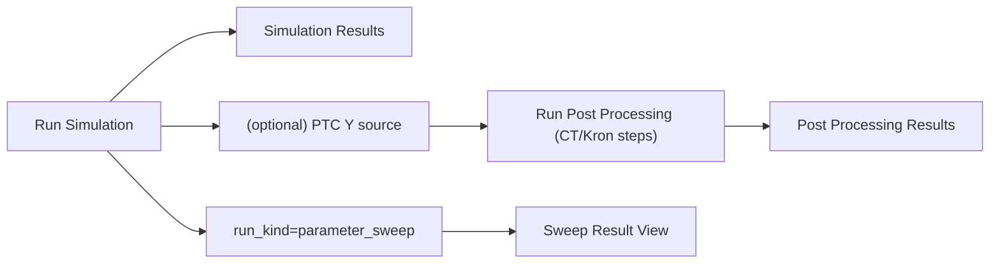

---
aliases:
- Simulation Result Views
- 模擬結果視圖
tags:
- diataxis/explanation
- audience/team
- topic/architecture
- topic/simulation
status: stable
owner: docs-team
audience: team
scope: High-level architecture of Raw/Post-Processed/Sweep result views
version: v0.2.0
last_updated: 2026-03-06
updated_by: codex
---

# Simulation Result Views

The current architecture exposes three result nodes, not one:

1. `Simulation Results` (raw run output)
2. `Post Processing Results` (after CT/Kron pipeline)
3. `Sweep Result View` (when `run_kind=parameter_sweep`)

This page explains the model and design intent. Field-level contracts live in Reference.

## Why Three Views

- Raw view keeps solver-native semantics (especially raw `S`)
- Post-processed view shows transformed/reduced-basis outputs
- Sweep view projects selected metrics over sweep axes

## Shared Interaction Pattern

Raw and Post-Processed use the same interaction shell:

- family tabs
- metric selector
- `Add Trace` cards (overlay)
- one shared plot

This keeps user interaction consistent across result nodes.

## Critical Semantics (Current)

1. Raw `S` must remain solver-native `S` (no silent PTC rewrite)
2. PTC semantics are primarily on `Y/Z` paths
3. Post-processed labels must match trace-card port labels (`Z_dm_cm`, etc.)
4. Title and y-axis labels must update with family/metric/trace changes (no stale axis text)

## HFSS Comparison Position

HFSS-comparable semantics are mainly evaluated on post-processing output:

- CT/Kron defines the effective basis (for example dm/cm)
- comparability status is attached to post-processed outputs with explicit reasons

Raw and post-processed semantics should not be merged.

## Sweep Position

Sweep is run-level output, not a trace hack:

- canonical authority is in run payload (bundle)
- result view may expose representative-point quick inspect
- full selector-over-axis exploration belongs to Sweep Result View

!!! note "Data contract anchor"
    The raw/post-processed/sweep payload authority still lives in `ResultBundleRecord`.
    This explanation page clarifies why the nodes are separate; it does not restate JSON field tables.

## Boundary with Reference

!!! important "Read together"
    - This page explains *why* the three views exist and how they differ.
    - Reference defines exact selectors, payload fields, and persistence contracts.

## Related

- [Circuit Simulation](index.md)
- [Circuit Simulation UI Reference](../../../reference/ui/circuit-simulation.en.md)
- [Dataset Record Schema](../../../reference/data-formats/dataset-record.en.md)
- [Analysis Result Schema](../../../reference/data-formats/analysis-result.en.md)
