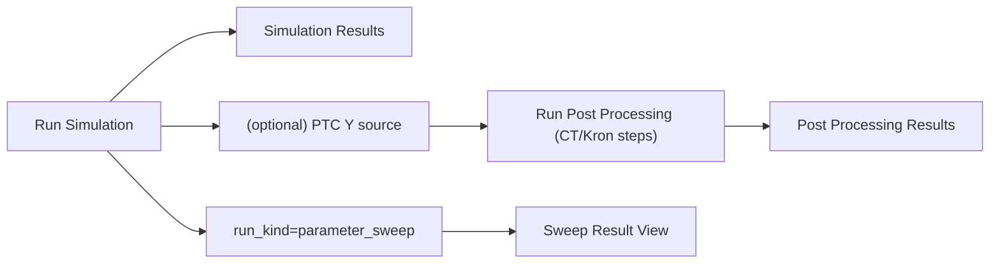

---
aliases:
- Simulation Result Views
- 模擬結果視圖
tags:
- diataxis/explanation
- audience/team
- topic/architecture
- topic/simulation
status: stable
owner: docs-team
audience: team
scope: Simulation / Post-Processed / Sweep Result 三類視圖的架構心智模型
version: v0.2.0
last_updated: 2026-03-06
updated_by: codex
---

# Simulation Result Views

目前實作不是單一視圖，而是三種結果節點共存：

1. `Simulation Results`（Raw run）
2. `Post Processing Results`（CT/Kron 後）
3. `Sweep Result View`（當 run_kind=parameter_sweep 時）

這頁描述的是架構心智模型；欄位與 UI 契約以 Reference 為準。

## Why Three Result Views

- Raw view 保留 solver 原始語意（尤其 `S`）
- Post-processed view 呈現基底轉換與降維後的結果
- Sweep view 聚焦「某個 selector 在掃描軸上的變化」

## Shared Interaction Pattern

Raw 與 Post-Processed 統一採用：

- family tabs
- metric selector
- `Add Trace` card（多 trace 疊圖）
- 單一 shared plot

這讓使用者在不同資料節點維持一致操作，不需要重新學一套 UI。

## Critical Semantics (Current)

1. `S` family 在 Raw view 必須維持 solver-native raw `S`
2. PTC 主要作用在 `Y/Z` 路徑，不應把 Raw `S` 靜默改寫成另一語意
3. Post-processed naming 要對齊 trace card 的輸入/輸出標籤（例如 `Z_dm_cm`）
4. family/metric/trace 切換後，title 與 y-axis label 必須同步，不可 stale

## HFSS Comparison Position

HFSS 可比對語意主要出現在 Post Processing 路徑：

- 使用者可透過 CT/Kron 定義等效 port basis（例如 dm/cm）
- 以該 basis 的輸出判斷 `HFSS comparable` 與原因

Raw 視圖仍保留原始模擬語意，兩者不能混為一談。

## Sweep Position

Sweep 是 run-level 結果，不是額外類型的 trace hack。

- canonical authority 在 run payload（bundle）
- Result View 可用代表點快速瀏覽
- 如需完整掃描曲線，使用 Sweep Result View 針對 selector 投影

!!! note "Data contract anchor"
    sweep / raw / post-processed 的 payload authority 仍在 `ResultBundleRecord`。
    Explanation 只幫助理解三種節點為何分開存在，不重述 JSON 欄位表。

## 這頁與 Reference 的邊界

!!! important "Read together"
    - 本頁：為什麼需要三種視圖與語意分層（Explanation）
    - Reference：每個欄位、selector、儲存 payload 的正式契約（Reference）

## Related

- [Circuit Simulation](index.md)
- [Circuit Simulation UI Reference](../../../reference/ui/circuit-simulation.md)
- [Dataset Record Schema](../../../reference/data-formats/dataset-record.md)
- [Analysis Result Schema](../../../reference/data-formats/analysis-result.md)
