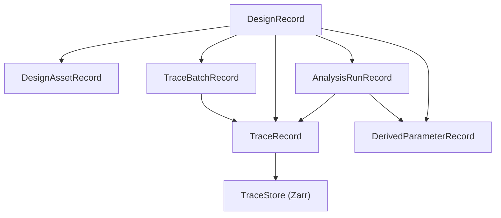

---
aliases:
  - Data Storage Architecture
tags:
  - diataxis/explanation
  - audience/team
  - topic/architecture
  - topic/data
status: stable
owner: docs-team
audience: team
scope: Design/Trace/TraceStore mental model and storage responsibility split
version: v1.0.0
last_updated: 2026-03-08
updated_by: codex
---

# Data Storage

This page explains:

- why the system needs `DesignRecord`
- why traces must be the shared analysis unit
- why the metadata DB and numeric TraceStore must be separated

## Core Mental Model

The project follows a **Design-centric + Trace-first + external TraceStore** architecture:

- `DesignRecord` is the root container
- `TraceRecord` is the trace authority
- `TraceBatchRecord` is the setup / provenance / lineage boundary
- `AnalysisRunRecord` is the characterization execution boundary
- `DerivedParameterRecord` stores extracted physics outputs
- `TraceStore` (`Zarr`) stores ND numeric payload

## Why Design-centric

The product wants to answer questions such as:

- what is the difference between layout and circuit results?
- what is the difference between measurement and simulation?
- for one design, which traces from which source can be characterized together?

So the top-level container should be:

- one design scope
- containing multiple source families of traces

## Why Trace-first

The shared Characterization input is not:

- a circuit-only model
- a layout-only model
- a measurement-only model

It is:

- **compatible S/Y/Z matrix traces**

That is why UI, plotting, compare, and analysis should all use `TraceRecord` as the standard unit.

## Why TraceBatchRecord exists

If you only store `TraceRecord`, you still do not know:

- whether the trace came from layout import or circuit simulation
- what sweep/setup was used
- what post-processing steps were applied
- which upstream raw batch it came from

That is the job of `TraceBatchRecord`:

- generalized setup
- source kind
- stage kind
- lineage
- status

## Why AnalysisRunRecord must stay separate from TraceBatchRecord

`TraceBatchRecord` answers:

- where the traces came from, under which setup, and across which lineage boundary

`AnalysisRunRecord` answers:

- which Characterization analysis was executed
- which input traces / input batches were used
- which run configuration was used
- what status and summary the run produced

The minimal phase-2 landing is:

- logical contract = `AnalysisRunRecord`
- physical persistence = metadata DB rows backed by `TraceBatchRecord(bundle_type="characterization", role="analysis_run")`
- repository boundary = `uow.result_bundles.analysis_runs`
- Characterization history / result navigation should read and write the analysis-run contract instead of falling back to generic batch labels

This preserves:

- `TraceBatchRecord` as the provenance boundary for trace-producing flows
- `AnalysisRunRecord` as the characterization execution boundary
- the no-migration constraint for the current phase

It does not mean:

- numeric trace payload can move back into the metadata DB
- point-per-record becomes the canonical `TraceRecord`
- Characterization history/provenance can collapse back into generic batch semantics

## Why metadata DB and TraceStore must split

If large numeric payload stays inside SQLite/PostgreSQL JSON/BLOB:

- sweep payload grows the DB too quickly
- slice reads are poor
- object-storage extension becomes awkward
- UI/analysis tends to become full-read then slice

After the split:

- the metadata DB handles queries, indexes, lineage, and setup
- the TraceStore handles chunked ND arrays

## Why canonical TraceRecord should stay ND

The natural meaning of a trace is:

- one observable over axes

Examples:

- `Imag(Y_dm_dm)` over `frequency`
- `Imag(Y_dm_dm)` over `(frequency, L_jun)`

Splitting every sweep point into its own canonical record may feel intuitive, but it causes:

- metadata explosion
- fragmented provenance
- regrouping overhead before Characterization can work

Recommended split:

- canonical = ND `TraceRecord`
- point/slice materialization = projection/cache/export

## Local first, extension later

This model scales naturally, but the only active path right now is local `Zarr`:

1. current
   - metadata: `SQLite`
   - numeric: local `Zarr`
2. future server
   - metadata: `PostgreSQL`
   - numeric: local or shared `Zarr`
3. storage extension (deferred)
   - metadata: `PostgreSQL`
   - numeric: `S3-compatible Zarr` (MinIO / S3)

!!! important "Current phase is local-only"
    `s3_zarr` / MinIO / S3 is not the active implementation target right now.
    The current phase only requires the local `Zarr` path to be stable, testable, and able to support the examples and app flows.

## No DB migration in the current program

There is no historical-data migration plan for the current program.

Why:

- the current data volume is still small
- there is no production data set that must be preserved yet
- instead of carrying a legacy-to-new migration path, the project should cut directly to the new schema when physical schema convergence begins

This means:

- the current phase may keep necessary logical compatibility layers while the refactor lands
- but once physical schema convergence begins, the preferred path is a **direct cutover to the new schema**
- migration cost must not be treated as a reason to delay schema convergence

## What this means for current features

### Simulation
- creates `TraceBatchRecord(source_kind=circuit_simulation, stage_kind=raw)`
- materializes `TraceRecord`
- writes numeric payload into the TraceStore

### Post-Processing
- derives a new `TraceBatchRecord` from an upstream simulation batch
- creates new post-processed traces
- does not overwrite raw traces

### Characterization
- does not branch by source kind
- only checks trace compatibility and selected traces
- produces `AnalysisRunRecord + DerivedParameterRecord`
- `AnalysisRunRecord` may persist run config, input trace ids, input batch ids, status, and summary
- numeric trace payload still belongs in the TraceStore; Characterization history must not regress into batch-only semantics

## Related

- [Design / Trace Schema](../../reference/data-formats/dataset-record.en.md)
- [Query Indexing Strategy](../../reference/data-formats/query-indexing-strategy.en.md)
