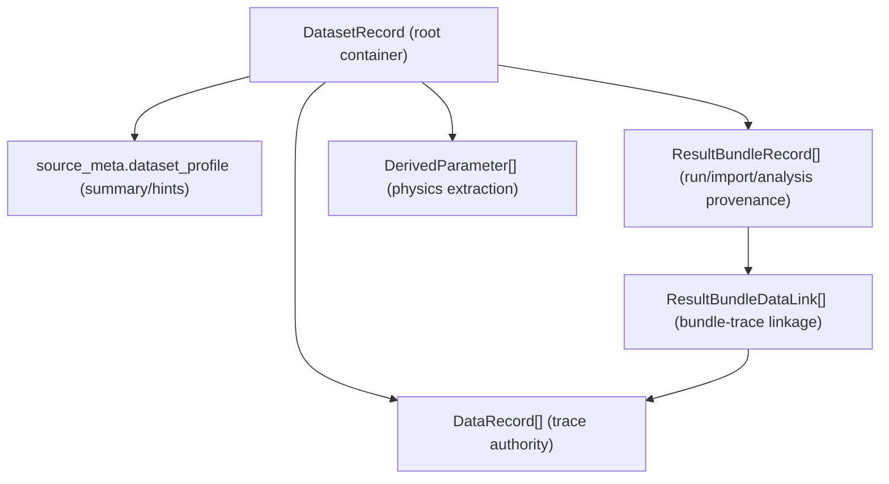
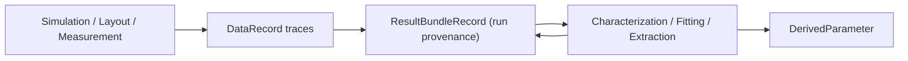

---
aliases:
  - Data Storage Architecture
  - Storage Model
tags:
  - diataxis/explanation
  - audience/team
  - topic/architecture
  - topic/data
status: stable
owner: docs-team
audience: team
scope: Dataset-centric storage model and cross-page data flow
version: v0.1.0
last_updated: 2026-03-06
updated_by: codex
---

# Data Storage

This page explains the storage model at a conceptual level.
Use this page for architecture understanding; use Reference pages for strict schema details.

## Core Mental Model

The system is **dataset-centric**:

- `DatasetRecord` is the root container
- `DataRecord` stores trace-level data
- `ResultBundleRecord` stores one run/import/analysis provenance unit
- `ResultBundleDataLink` links bundles to traces
- `DerivedParameter` stores extracted physics parameters

!!! important "Trace-first authority"
    Analysis executability is decided by trace compatibility and selected trace ids.
    `dataset_profile` is summary/recommendation metadata, not sole run authority.

## Responsibility Layers

### 1) Dataset layer (container)

- Owns source metadata, tags, and high-level profile
- Does not replace trace-level eligibility checks

### 2) Trace layer (observable data)

- Stores actual curves/matrices (`Y11(f)`, `S21(f)`, `Zin(f, bias)`, etc.)
- Acts as direct input for analysis and result views

### 3) Bundle layer (provenance/reproducibility)

- Records how each run was produced (config, scope, source, status)
- Sweep, post-process, and characterization all belong here

### 4) Derived layer (physics outputs)

- Stores extracted quantities (resonance, Q, fit outputs, etc.)
- Should not be treated as raw trace authority unless explicitly contracted

## Runtime Flow (High-Level)

## Read This Together with Reference

- [Dataset Record Schema](../../reference/data-formats/dataset-record.en.md)
- [Analysis Result Schema](../../reference/data-formats/analysis-result.en.md)
- [Circuit Netlist Schema](../../reference/data-formats/circuit-netlist.en.md)
- [Data Formats Overview](../../reference/data-formats/index.en.md)

## Common Misunderstandings

1. "Dataset profile alone decides analysis availability."  
No. It is a hint layer; run authority is still trace-first.

2. "ResultBundle is an independent cache store detached from Dataset."  
No. Bundles are still dataset-owned provenance units.

3. "DerivedParameter can always be reused as raw trace input."  
No, unless an analysis contract explicitly allows it.

## Related

- [Architecture Overview](index.en.md)
- [Pipeline Data Flow](pipeline/data-flow.en.md)
- [Characterization UI](../../reference/ui/characterization.en.md)
