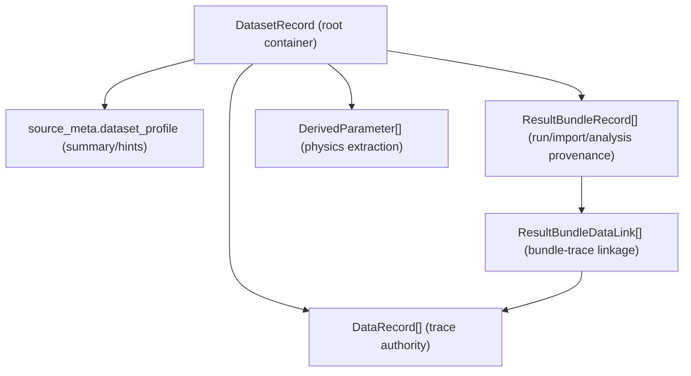
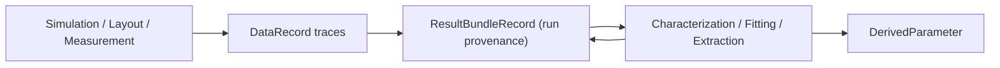

---
aliases:
  - Data Storage Architecture
  - 資料儲存架構
tags:
  - diataxis/explanation
  - audience/team
  - topic/architecture
  - topic/data
status: stable
owner: docs-team
audience: team
scope: Dataset-centric 資料儲存心智模型與跨頁面資料流
version: v0.1.0
last_updated: 2026-03-06
updated_by: codex
---

# Data Storage

這頁回答的不是「欄位怎麼定義」，而是「整個系統如何理解與保存資料」。

Reference 會定義 schema；本頁則提供高層可理解模型，幫助你判斷資料應該落在哪一層。

## Core Mental Model

本專案採 **Dataset-centric architecture**：

- `DatasetRecord` 是 root container
- `DataRecord` 是 trace（曲線/矩陣）資料
- `ResultBundleRecord` 是一次 run/import/analysis 的 provenance 容器
- `ResultBundleDataLink` 是 bundle 與 traces 的關聯
- `DerivedParameter` 是由分析提取出的物理參數

!!! important "Trace-first authority"
    是否能跑 analysis，核心依據是 trace 相容性與 selected trace ids。
    `dataset_profile` 是摘要與建議，不是唯一 run authority。

## Data Topology by Responsibility

### 1) Dataset layer（container）

- 管理資料集合、來源 metadata、tag、高層 profile
- 不直接取代 trace-level 的可執行判斷

### 2) Trace layer（observable data）

- 保存可分析的實際曲線：`Y11(f)`、`S21(f)`、`Zin(f, bias)` 等
- 是 Analysis、Result View、後續流程的直接輸入素材

### 3) Bundle layer（provenance and reproducibility）

- 描述每次運行如何產生結果（設定、來源、scope、狀態）
- sweep / post-process / characterization 都屬於 bundle contract 的一部分

### 4) Derived layer（physics）

- 保存萃取結果（例如 resonance、Q、擬合參數）
- 由 trace 透過分析方法得到，不應反過來當 raw trace authority

## Runtime Flow (High-Level)

!!! note "為什麼 Characterization UI 預設 dataset-centric"
    UI 以 Dataset 作為主要操作入口，但實際 run 仍在 trace 層做相容性與選取。
    這樣可以兼顧使用直覺與運行嚴謹性。

## How to Read with Reference Pages

需要欄位細節、型別或 JSON 範例時，請看 Reference：

- [Dataset Record Schema](../../reference/data-formats/dataset-record.md)
- [Analysis Result Schema](../../reference/data-formats/analysis-result.md)
- [Circuit Netlist Schema](../../reference/data-formats/circuit-netlist.md)
- [Data Formats Overview](../../reference/data-formats/index.md)

## Common Misunderstandings

1. 「Dataset profile 決定分析可不可跑」  
不是。profile 主要是 hint；run authority 仍是 trace-first。

2. 「ResultBundle 是獨立資料庫，不附屬 Dataset」  
不是。bundle 仍附屬 dataset；只是承擔 provenance 與重現性。

3. 「DerivedParameter 可以當作下一輪 raw trace 輸入」  
預設不行，除非某分析明確宣告這個契約。

## Related

- [Architecture Overview](index.md)
- [Pipeline Data Flow](pipeline/data-flow.md)
- [Characterization UI](../../reference/ui/characterization.md)
