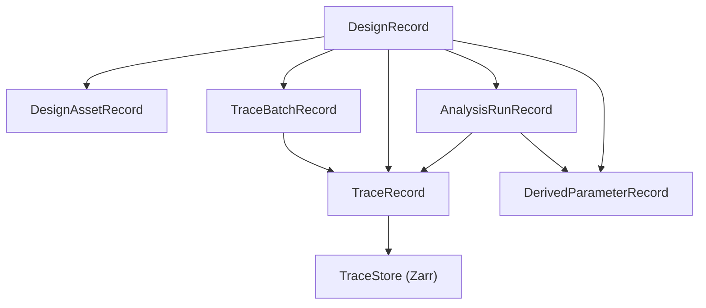

---
aliases:
  - Data Storage Architecture
  - 資料儲存架構
tags:
  - diataxis/explanation
  - audience/team
  - topic/architecture
  - topic/data
status: stable
owner: docs-team
audience: team
scope: Design/Trace/TraceStore 心智模型與資料責任分層
version: v1.0.0
last_updated: 2026-03-08
updated_by: codex
---

# Data Storage

本頁回答的是：

- 為什麼系統需要 `DesignRecord`
- 為什麼 trace 應該是統一分析單位
- 為什麼 metadata DB 與 numeric TraceStore 必須分離

## Core Mental Model

本專案採 **Design-centric + Trace-first + external TraceStore** architecture：

- `DesignRecord` 是 root container
- `TraceRecord` 是 trace authority
- `TraceBatchRecord` 是 setup / provenance / lineage boundary
- `AnalysisRunRecord` 是 characterization execution boundary
- `DerivedParameterRecord` 是物理萃取結果
- `TraceStore`（`Zarr`）保存 ND numeric payload

## Why Design-centric

你的產品想回答的是：

- layout 與 circuit 的差異是什麼？
- measurement 與 simulation 的差異是什麼？
- 對同一個設計，哪種來源的 traces 可以拿來做同一套 characterization？

所以最高層 container 不能只是一批 dataset records，而應該是：

- 一個 design scope
- 其中容納多種來源 traces

## Why Trace-first

Characterization 的統一輸入其實不是：

- circuit 專屬資料模型
- layout 專屬資料模型
- measurement 專屬資料模型

而是：

- **相容的 S/Y/Z matrix traces**

因此 UI、plotting、compare、analysis 都應以 `TraceRecord` 為標準操作單位。

## Why TraceBatchRecord exists

如果只有 `TraceRecord`，你仍然不知道：

- 這批 traces 是 layout import 還是 circuit simulation？
- sweep setup 是什麼？
- post-processing steps 是什麼？
- 上游是哪一批 raw traces？

這就是 `TraceBatchRecord` 的責任：

- generalized setup
- source kind
- stage kind
- lineage
- status

## Why metadata DB and TraceStore must split

如果把大型 numeric payload 繼續放在 SQLite/PostgreSQL JSON/BLOB：

- sweep payload 會讓 DB 快速膨脹
- slice read 很差
- object storage extension 不自然
- UI/analysis 容易變成 full-read then slice

把責任拆開後：

- metadata DB 負責查詢、索引、lineage、setup
- TraceStore 負責 chunked ND arrays

## Why canonical TraceRecord should stay ND

一條 trace 的自然語意是：

- one observable over axes

例如：

- `Imag(Y_dm_dm)` over `frequency`
- `Imag(Y_dm_dm)` over `(frequency, L_jun)`

把 sweep 每個點都拆成 canonical record，看起來直覺，但會造成：

- metadata 爆量
- provenance 很碎
- Characterization 反而要先 regroup

所以建議：

- canonical = ND `TraceRecord`
- point/slice materialization = projection/cache/export

## Local to Server to Object Storage

這套模型天然支持演進：

1. 現階段
   - metadata: `SQLite`
   - numeric: local `Zarr`
2. 未來 server
   - metadata: `PostgreSQL`
   - numeric: local or shared `Zarr`
3. storage extension
   - metadata: `PostgreSQL`
   - numeric: `S3-compatible Zarr`（MinIO / S3）

## What this means for current features

### Simulation
- 產生 `TraceBatchRecord(source_kind=circuit_simulation, stage_kind=raw)`
- materialize `TraceRecord`
- numeric payload 進 TraceStore

### Post-Processing
- 從上游 simulation batch 派生新的 `TraceBatchRecord`
- 建立新的 post-processed traces
- 不覆寫 raw traces

### Characterization
- 不區分來源
- 只看 trace compatibility 與 selected traces
- 產生 `AnalysisRunRecord + DerivedParameterRecord`

## Related

- [Design / Trace Schema](../../reference/data-formats/dataset-record.md)
- [Query Indexing Strategy](../../reference/data-formats/query-indexing-strategy.md)
