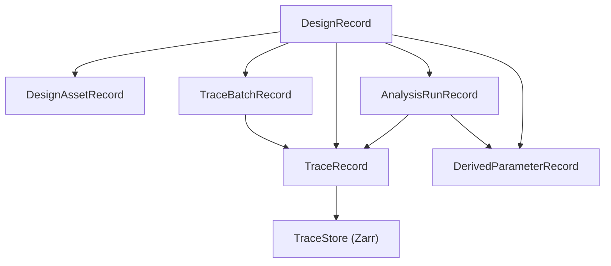

---
aliases:
  - Data Storage Architecture
  - 資料儲存架構
tags:
  - diataxis/explanation
  - audience/team
  - topic/architecture
  - topic/data
status: stable
owner: docs-team
audience: team
scope: Design/Trace/TraceStore 心智模型與資料責任分層
version: v1.0.0
last_updated: 2026-03-08
updated_by: codex
---

# Data Storage

本頁回答的是：

- 為什麼系統需要 `DesignRecord`
- 為什麼 trace 應該是統一分析單位
- 為什麼 metadata DB 與 numeric TraceStore 必須分離

## Core Mental Model

本專案採 **Design-centric + Trace-first + external TraceStore** architecture：

- `DesignRecord` 是 root container
- `TraceRecord` 是 trace authority
- `TraceBatchRecord` 是 setup / provenance / lineage boundary
- `AnalysisRunRecord` 是 characterization execution boundary
- `DerivedParameterRecord` 是物理萃取結果
- `TraceStore`（`Zarr`）保存 ND numeric payload

## Why Design-centric

你的產品想回答的是：

- layout 與 circuit 的差異是什麼？
- measurement 與 simulation 的差異是什麼？
- 對同一個設計，哪種來源的 traces 可以拿來做同一套 characterization？

所以最高層 container 不能只是一批 dataset records，而應該是：

- 一個 design scope
- 其中容納多種來源 traces

## Why Trace-first

Characterization 的統一輸入其實不是：

- circuit 專屬資料模型
- layout 專屬資料模型
- measurement 專屬資料模型

而是：

- **相容的 S/Y/Z matrix traces**

因此 UI、plotting、compare、analysis 都應以 `TraceRecord` 為標準操作單位。

## Why TraceBatchRecord exists

如果只有 `TraceRecord`，你仍然不知道：

- 這批 traces 是 layout import 還是 circuit simulation？
- sweep setup 是什麼？
- post-processing steps 是什麼？
- 上游是哪一批 raw traces？

這就是 `TraceBatchRecord` 的責任：

- generalized setup
- source kind
- stage kind
- lineage
- status

## Why AnalysisRunRecord must stay separate from TraceBatchRecord

`TraceBatchRecord` 回答的是：

- traces 是從哪個來源、哪個 setup、哪個 lineage 邊界來的

`AnalysisRunRecord` 回答的是：

- Characterization 執行了哪個 analysis
- 用了哪些 input traces / input batches
- 使用了什麼 run config
- 這次 run 的狀態與摘要是什麼

Phase-2 的最小可整合落地方向是：

- logical contract = `AnalysisRunRecord`
- physical persistence = metadata DB 中由 `TraceBatchRecord(bundle_type="characterization", role="analysis_run")` 承載
- repository boundary = `uow.result_bundles.analysis_runs`
- Characterization UI history / result navigation 應讀寫 analysis-run contract，而不是退回 generic batch label

這樣可以同時保留：

- `TraceBatchRecord` 作為 trace-producing flows 的 provenance boundary
- `AnalysisRunRecord` 作為 characterization execution boundary
- 現階段不做 migration 的要求

這不代表：

- 可以把 trace numeric payload 放回 metadata DB
- 可以把 point-per-record 當 canonical `TraceRecord`
- 可以把 Characterization history/provenance 簡化成模糊的 batch semantics

## Why metadata DB and TraceStore must split

如果把大型 numeric payload 繼續放在 SQLite/PostgreSQL JSON/BLOB：

- sweep payload 會讓 DB 快速膨脹
- slice read 很差
- object storage extension 不自然
- UI/analysis 容易變成 full-read then slice

把責任拆開後：

- metadata DB 負責查詢、索引、lineage、setup
- TraceStore 負責 chunked ND arrays

## Why canonical TraceRecord should stay ND

一條 trace 的自然語意是：

- one observable over axes

例如：

- `Imag(Y_dm_dm)` over `frequency`
- `Imag(Y_dm_dm)` over `(frequency, L_jun)`

把 sweep 每個點都拆成 canonical record，看起來直覺，但會造成：

- metadata 爆量
- provenance 很碎
- Characterization 反而要先 regroup

所以建議：

- canonical = ND `TraceRecord`
- point/slice materialization = projection/cache/export

## Local first, extension later

這套模型天然支持演進，但目前 active path 只有 local `Zarr`：

1. 現階段
   - metadata: `SQLite`
   - numeric: local `Zarr`
2. 未來 server
   - metadata: `PostgreSQL`
   - numeric: local or shared `Zarr`
3. storage extension（deferred）
   - metadata: `PostgreSQL`
   - numeric: `S3-compatible Zarr`（MinIO / S3）

!!! important "Current phase is local-only"
    `s3_zarr` / MinIO / S3 目前不是當前 phase 的實作目標。
    現階段只要求 local `Zarr` 路徑穩定、可驗證、可支撐 examples 與 app flows。

## No DB Migration in the current program

目前不規劃歷史資料 migration。

原因是：

- 現有資料量小
- 尚未有正式產品資料需要保留
- 與其維護 legacy-to-new migration path，不如在 physical schema 收斂時直接切到新 schema

這代表：

- 現階段可以保留必要的 logical compatibility layer 來完成重構
- 但當 physical schema 收斂時，應優先採用 **direct cutover to the new schema**
- 不應把 migration 成本當成延後 schema 收斂的前提

## What this means for current features

### Simulation
- 產生 `TraceBatchRecord(source_kind=circuit_simulation, stage_kind=raw)`
- materialize `TraceRecord`
- numeric payload 進 TraceStore

### Post-Processing
- 從上游 simulation batch 派生新的 `TraceBatchRecord`
- 建立新的 post-processed traces
- 不覆寫 raw traces

### Characterization
- 不區分來源
- 只看 trace compatibility 與 selected traces
- 產生 `AnalysisRunRecord + DerivedParameterRecord`
- `AnalysisRunRecord` 可持久化 run config、input trace ids、input batch ids、status、summary
- trace numeric payload 仍留在 TraceStore；Characterization history 不應回退成 generic batch-only 語意

## Persisted Orchestration Strategy

UI 不應再把 live session state 當成 run authority。

長期正確模型是：

- UI / CLI 只建立 persisted run boundary
- backend worker 根據 metadata DB + TraceStore 執行
- execution progress / status / outputs 全部回寫 persisted records
- 讀取端永遠只依賴 persisted state，而不是 `latest_*` runtime variables

### Trace-producing flows

對 `simulation` / `post-processing` / `layout ingest` / `measurement ingest`：

- execution boundary = `TraceBatchRecord`
- `status=running/completed/failed`
- `setup_payload` = execution request contract
- `provenance_payload` = source batch ids / source trace ids / source asset ids
- numeric output = TraceStore slices / chunks

也就是：

- `TraceBatchRecord` 不只描述「這批 traces 是什麼」
- 也描述「這次 trace-producing run 正在做什麼」

對 `/simulation` 與 `/post-processing` 這類 UI 來說，這也代表：

- active design selection 應優先解析成 persisted input/output batches
- result views 應優先從 persisted batches + TraceStore 讀取
- live session `latest_*` state 可以存在，但只能當成短期 preview / just-finished bridge
- persisted workflow 不得因為 UI 重整、reconnect、或切頁而失去 authority

### Analysis flows

對 `Characterization`：

- execution boundary = `AnalysisRunRecord`
- input authority = selected trace ids / input batch ids
- output authority = `DerivedParameterRecord` + analysis artifacts

### Why this matters

如果 `Simulation` / `Post-Processing` 仍依賴 live session：

- UI refresh / reconnect / stale client 會影響 workflow continuity
- CLI 與 UI 會走兩套不同 contract
- saved raw batch 無法自然重新 post-process
- cache hit / cache miss 會變成 page-local state 問題，而不是 persisted execution state 問題

Persisted orchestration 的目標是：

- UI 只是 interaction surface
- CLI 只是另一個 interaction surface
- backend 一律依據 persisted records 執行

### Current vs Target

- `Current`
  - trace numeric payload 已進 TraceStore
  - result views 大致已是 slice-first
  - 但 `/simulation` run / post-processing 仍保留部分 live-session orchestration
- `Target`
  - `Run Simulation` 直接建立 / 更新 persisted `TraceBatchRecord`
  - `Run Post Processing` 直接選 persisted raw source batch
  - cache hit 只縮短 run path，不得成為 post-processing / Characterization 的 authority 來源
  - UI / CLI 都不再要求「先有目前頁面的 live result」

## Related

- [Design / Trace Schema](../../reference/data-formats/dataset-record.md)
- [Query Indexing Strategy](../../reference/data-formats/query-indexing-strategy.md)
