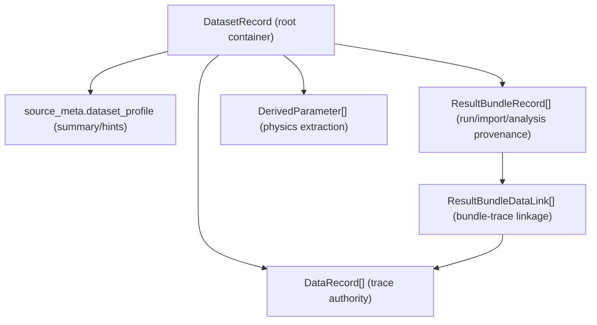
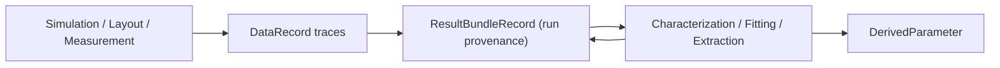

---
aliases:
  - Data Storage Architecture
  - 資料儲存架構
tags:
  - diataxis/explanation
  - audience/team
  - topic/architecture
  - topic/data
status: stable
owner: docs-team
audience: team
scope: Dataset-centric 資料儲存心智模型與跨頁面資料流
version: v0.2.0
last_updated: 2026-03-07
updated_by: codex
---

# Data Storage

這頁回答的不是「欄位怎麼定義」，而是「整個系統如何理解與保存資料」。

Reference 會定義 schema；本頁則提供高層可理解模型，幫助你判斷資料應該落在哪一層。

## Core Mental Model

本專案採 **Dataset-centric architecture**：

- `DatasetRecord` 是 root container
- `DataRecord` 是 trace（曲線/矩陣）資料
- `ResultBundleRecord` 是一次 run/import/analysis 的 provenance 容器
- `ResultBundleDataLink` 是 bundle 與 traces 的關聯
- `DerivedParameter` 是由分析提取出的物理參數

!!! important "Trace-first authority"
    是否能跑 analysis，核心依據是 trace 相容性與 selected trace ids。
    `dataset_profile` 是摘要與建議，不是唯一 run authority。

## Data Topology by Responsibility

### 1) Dataset layer（container）

- 管理資料集合、來源 metadata、tag、高層 profile
- 不直接取代 trace-level 的可執行判斷

### 2) Trace layer（observable data）

- 保存可分析的實際曲線：`Y11(f)`、`S21(f)`、`Zin(f, bias)` 等
- 是 Analysis、Result View、後續流程的直接輸入素材

### 3) Bundle layer（provenance and reproducibility）

- 描述每次運行如何產生結果（設定、來源、scope、狀態）
- sweep / post-process / characterization 都屬於 bundle contract 的一部分

!!! important "Sweep authority stays in bundle payload"
    parameter sweep 的 canonical source of truth 應保留在 bundle payload。
    UI 顯示用的 representative point 只是 quick-inspect projection，不是唯一 authority。

!!! note "Post-processed sweep is a different node"
    若 post-processing 作用在 raw sweep 上，產生的是另一個 `simulation_postprocess` bundle。
    它必須保留自己的 provenance 與 sweep metadata，不能覆寫 raw simulation sweep 的 authority。

### 4) Derived layer（physics）

- 保存萃取結果（例如 resonance、Q、擬合參數）
- 由 trace 透過分析方法得到，不應反過來當 raw trace authority

## Runtime Flow (High-Level)

!!! note "為什麼 Characterization UI 預設 dataset-centric"
    UI 以 Dataset 作為主要操作入口，但實際 run 仍在 trace 層做相容性與選取。
    這樣可以兼顧使用直覺與運行嚴謹性。

## Post-Processed Sweep Point Materialization Strategy

這裡討論的是一個刻意保留的產品/架構決策：
當 post-processing 來源是 parameter sweep 時，保存結果是否應同步把每個 sweep 點的
post-processed values 全量 materialize 成 durable snapshot。

### Current

目前契約的重點是：

- raw sweep 的 canonical authority 仍在 `ResultBundleRecord.result_payload`
- `simulation_postprocess` bundle 保存 canonical provenance、flow/config snapshot、
  以及足以重播上游 sweep + post-processing 的 replay handles
- `DataRecord` 仍是 projection/index 化視圖，而不是 bundle authority 的替代品

目前策略已解決：

- 可回推來源 sweep bundle、設定快照與分析 scope
- 可在不複製整份高維 payload 的前提下保留 replayability
- 可維持 `DataRecord as projection` 與 raw/post-process 分離節點的既有邊界

目前策略尚未解決：

- 離線或跨版本消費者若要求「不經 replay 即可讀出每個 post-processed sweep 點」
- 將 post-processed sweep 視為 immutable frozen snapshot artifact 的產品語意
- read path 想直接取得完整 processed points 時的低延遲需求

### Option A

對每次 post-processed sweep save 都 eager materialize every point，將完整 processed values
直接保存進 `simulation_postprocess` bundle payload。

成本與影響：

- storage size：近似再複製一份 sweep 結果，成本隨 `point_count x family_count x matrix_size x frequency_samples`
  放大；對高維 sweep 最敏感
- write latency：save path 必須等待所有 processed points 序列化完成，保存時間與失敗面積都變大
- replay/read complexity：read path 對 snapshot-only consumer 較簡單，但 writer、reader、projection
  都需要處理「有 materialized points / 無 materialized points」雙路徑
- downstream compatibility：對需要自包含 artifact 的下游較友善，但現有 bundle consumer 需新增大型 payload
  處理邏輯，且歷史資料仍是非 materialized 舊格式

契約層影響：

- schema change：需要，至少要新增明確的 materialized-point payload 契約
- migration：不應假設已批准；若採 additive rollout，可避免強制回填，但必須接受新舊 bundle 並存
- new bundle subtype：不一定需要，但若 full snapshot 變成獨立 artifact 語意，沿用既有 subtype 會模糊責任
- new projection strategy：不需要，`DataRecord` 仍可維持 projection；只是 read path 會偏向 snapshot payload

### Option B

維持 replay-first base contract，不要求每次 save 都 materialize every point；若未來真的需要
self-contained frozen artifact，再以顯式 snapshot 契約另行擴充。

成本與影響：

- storage size：維持目前最小增量，只保存 provenance、config snapshot、replay handles 與既有 projection
- write latency：接近目前 save path，避免把高維 processed payload 變成同步保存必要條件
- replay/read complexity：需要保留 replay/read path，但責任清楚，bundle authority 與 projection 不混用
- downstream compatibility：現有 consumer 可延續目前語意；未來若新增 snapshot artifact，可由需要的 consumer opt-in

契約層影響：

- schema change：目前不需要強制 schema 擴張；先把 base contract 寫清楚即可
- migration：目前不需要；也不得預設歷史 bundle 具備 full snapshot 語意
- new bundle subtype：base contract 不需要；若未來批准 full snapshot/export artifact，建議用新 subtype
  或等價的顯式 artifact 契約，而不是默默改寫 `simulation_postprocess`
- new projection strategy：不需要；繼續使用 `DataRecord as projection`

### Recommended

推薦 **Option B: replay-first base contract + future explicit snapshot opt-in**。

理由：

- 它保留目前已建立的 canonical authority 邊界，不回退 raw sweep authority 與 `DataRecord as projection`
- 它是最小安全方案：先把 save 的保證限定為 provenance、replayability、可追蹤的 projection，
  不把 full snapshot 承諾偷渡進既有 subtype
- 它把昂貴的 storage/write 成本留給真正有需求的場景，而不是讓所有 post-processed sweep save
  一律承擔

推薦決策（目前）：

- schema change：`No`，先以文件明確界定 base contract
- migration：`No`，不得假設已批准
- new bundle subtype：`No`，僅在未來明確批准 self-contained snapshot/export artifact 時再新增
- new projection strategy：`No`，延續既有 `DataRecord` projection 與 bundle-link model

### Guardrail Candidates

適合升級成 Guardrails 的條目：

- `simulation_postprocess` save 預設保證 replayability，不預設保證每個 sweep 點 full snapshot
- raw sweep canonical authority 必須留在 `ResultBundleRecord.result_payload`
- `DataRecord` 只能作為 projection/index 視圖，不能被重新定義為 post-processed sweep 唯一 SoT
- 若產品要引入 self-contained snapshot/export artifact，必須走顯式契約審查，且不得默默覆寫既有 subtype 語意
- 未批准 migration 前，不得假設歷史 post-process bundles 可被當作 fully materialized snapshot 讀取

## How to Read with Reference Pages

需要欄位細節、型別或 JSON 範例時，請看 Reference：

- [Dataset Record Schema](../../reference/data-formats/dataset-record.md)
- [Analysis Result Schema](../../reference/data-formats/analysis-result.md)
- [Circuit Netlist Schema](../../reference/data-formats/circuit-netlist.md)
- [Data Formats Overview](../../reference/data-formats/index.md)

## Common Misunderstandings

1. 「Dataset profile 決定分析可不可跑」  
不是。profile 主要是 hint；run authority 仍是 trace-first。

2. 「ResultBundle 是獨立資料庫，不附屬 Dataset」  
不是。bundle 仍附屬 dataset；只是承擔 provenance 與重現性。

3. 「DerivedParameter 可以當作下一輪 raw trace 輸入」  
預設不行，除非某分析明確宣告這個契約。

4. 「representative point 就是整個 sweep 的正式保存內容」
不是。representative point 只能幫 UI 快速檢視；完整 sweep authority 仍應保留在 bundle payload。

## Related

- [Architecture Overview](index.md)
- [Pipeline Data Flow](pipeline/data-flow.md)
- [Characterization UI](../../reference/ui/characterization.md)
