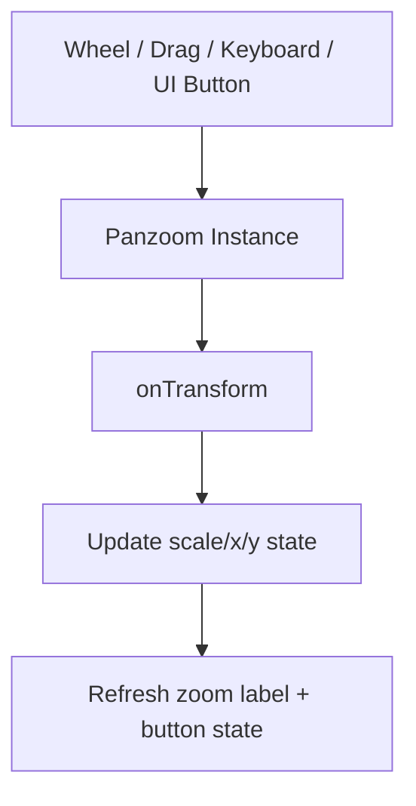

---
aliases:
  - Circuit Schema Live Preview
  - Circuit Schema 即時預覽
tags:
  - diataxis/explanation
  - audience/team
  - topic/architecture
  - topic/visualization
status: draft
owner: docs-team
audience: team
scope: Live Preview 的語意驅動渲染策略、Panzoom 互動契約、可觀測性與驗證規則
version: v0.5.5
last_updated: 2026-02-28
updated_by: docs-team
---

# Circuit Schema Live Preview

本頁定義 Live Preview 的主契約：以 **domain-specific semantics** 為先、以可讀性為核心、以可驗證行為為交付標準。

!!! note "Tech Stack 說明位置"
    本頁不展開技術堆疊細節。請以 [Guardrails / Project Basics / Tech Stack](../../../reference/guardrails/project-basics/tech-stack.md) 為主。

## Core Decision

| 決策 | 說明 |
|---|---|
| 語意優先 | 超導電路（Qubit/JPA/JTWPA）不是一般 graph drawing，不能只追最短線長 |
| 可讀性優先 | 「看起來像正確電路」優先於幾何最短 |
| 契約化 | 渲染、縮放、標註、路由都要可驗證與可回歸 |

!!! info "設計輸入來源"
    本頁吸收了 NetlistSVG/ELK 類實務、schematic hyperedge routing 研究、Panzoom 互動層常見風險。詳細連結見文末 References。

## Rendering Contract

| 契約項目 | 主要求 |
|---|---|
| Net/Hyperedge | 同 node 端點先收斂為同一 net，再做幹線連接 |
| Lanes | Signal/Ground 為主幹，Bridge 只在必要衝突時啟用 |
| Layout Mode | Pattern-aware 優先，無法辨識時退回 Generic Orthogonal |
| Labels | 用局部約束選址，避免固定 offset 造成密集重疊 |
| Routing | 主幹保持水平連續，避免不必要上提/下折 |
| Parameter Binding | 顯示值固定來自 `value_ref -> parameters` |

!!! tip "Pattern-aware vs Generic fallback"
    偵測到 JTWPA/JJTWPA 這類重複 cell 結構時，走 ladder-first。
    classifier 信心不足時必須退回 generic orthogonal，不可硬套 ladder。

!!! success "已實作到程式的第一階段（2026-02-28）"
    目前 `circuit_visualizer` 已落地以下行為：
    - 粗粒度 profile classifier：`generic` / `jpa_like` / `jtwpa_like`
    - 簡單鏈狀 topology 會先抽出固定的 signal backbone（主幹 node anchor）
    - 依 signal node 建立 shunt cluster metadata（同節點多個垂直支路可辨識）
    - 高密度 shunt 會以 branch offset 從 backbone 向左右展開，而不是把主幹往前擠
    - 垂直支路標籤改為 cluster-aware 的左右外擴標示，而非固定堆疊在元件旁

!!! warning "Bridge 可觀測性要求"
    每段 bridge 必須記錄 `bridge_id`, `conflict_reason`, `involved_nets`, `final_geometry`，否則不可視為可維護行為。

!!! warning "已知缺口（2026-02-28）"
    目前程式實作仍未完成以下契約：
    - 真正的 `Net/Hyperedge` 主幹模型（目前只有「simple chain backbone」特例）
    - 局部約束式 label 選址（目前僅是 cluster-aware outward placement）
    - 完整的 pattern-aware routing（目前只先影響 backbone / spacing / 標註）
    - bridge observability metadata（尚未輸出 `bridge_id` 等診斷資訊）
    因此在更高密度的三支路以上 shunt、超長數值字串、或混合耦合元件區，仍可能出現文字互相逼近或與線段距離不足的情況。

## Panzoom Contract

| 契約項目 | 主要求 |
|---|---|
| DOM 分層 | `Viewport`（事件/裁切）→ `Panzoom Container`（唯一 transform）→ `SVG Host`（內容替換） |
| Lifecycle | mount 建單例、update 只換 host、unmount destroy instance |
| State | 至少保存 `scale`, `x`, `y`, `schema_id`, `svg_signature` |
| Input Policy | `Ctrl + wheel` 縮放、`wheel` 保留捲動、觸控手勢要有 `touch-action` 邊界 |
| Control Sync | 滾輪/拖曳/鍵盤/`+ - reset` 按鈕必須共用同一個 panzoom state 與 update callback |

!!! warning "縮放狀態保留條件"
    只有在尺寸相容時保留 transform；不相容就 `fit` 或 `reset`。
    建議門檻：長寬比差異 <= 5%，寬高差異各 <= 15%。

!!! tip "按鈕與直接操作同步規則"
    `+`、`-`、`Reset` 不可自行維護獨立縮放值，必須呼叫同一個 panzoom instance API。
    UI 百分比顯示（例如 `120%`）只能來自同一個 `onTransform` 事件，避免狀態分裂。

## Domain Semantics

領域語意設定改為單獨文件管理，以避免主文過長且方便獨立演進：

- [Live Preview Domain Semantics Profiles](live-preview-domain-semantics.md)

!!! note "目前分文件策略"
    先維持「1 份主文 + 1 份 profile」；當 Quantum Memory 等領域有足夠穩定案例後，再拆分為多份 domain 文件。

## Validation and Non-Regression

| Case | 核心目標 |
|---|---|
| SmokeStableSeriesLC | baseline 可讀性與 node 單次標註 |
| Flux-pumped JPA | 邊界 port 標籤與高密度 shunt 佈局 |
| JTWPA (10-20 cells) | ladder 可辨識、主幹連續、可縮放檢視 |
| Floquet JTWPA with Dissipation | 變體元件不破壞主視覺 |
| Label torture test | 100%/150% 下 label 不可大面積遮元件 |

!!! success "硬性非回歸約束"
    1) 每個 node 只標註一次
    2) 顯示值來源固定為 `value_ref -> parameters`
    3) 禁止導線穿過元件符號
    4) Reset Zoom 必須穩定回到預設視角

## Related

- [Live Preview Domain Semantics Profiles](live-preview-domain-semantics.md)
- [Dataset Schema Design](schema-design.md)
- [Visualization Backend](visualization-backend.md)
- [Data Formats](../../../reference/data-formats/index.md)

## References

- NetlistSVG repository: [https://github.com/nturley/netlistsvg](https://github.com/nturley/netlistsvg)
- NetlistSVG layout notes: [https://observablehq.com/@nturley/netlistsvg-how-to-draw-a-better-schematic-than-graphviz](https://observablehq.com/@nturley/netlistsvg-how-to-draw-a-better-schematic-than-graphviz)
- Interactive orthogonal hyperedge routing: [https://www.researchgate.net/publication/354725826_Interactive_Orthogonal_Hyperedge_Routing_in_Schematic_Diagrams_Assisted_by_Layout_Automatisms](https://www.researchgate.net/publication/354725826_Interactive_Orthogonal_Hyperedge_Routing_in_Schematic_Diagrams_Assisted_by_Layout_Automatisms)
- svg-pan-zoom README: [https://github.com/bumbu/svg-pan-zoom/blob/master/README.md](https://github.com/bumbu/svg-pan-zoom/blob/master/README.md)
