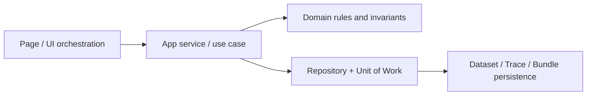

---
aliases:
  - "Clean Architecture"
  - "Layered Architecture"
tags:
  - diataxis/explanation
  - audience/team
  - topic/architecture
  - topic/data
  - topic/ui
status: stable
owner: docs-team
audience: team
scope: "Mental model for page / use case / domain / repository-uow responsibility boundaries"
version: v0.2.0
last_updated: 2026-03-06
updated_by: codex
---

# Clean Architecture

This page is not a folder-tree description.
It explains why the current system separates page orchestration, use cases, domain rules, and repository / Unit of Work responsibilities.

## Current Flow in One Picture

That split maps to the contracts already defined in the docs:

- the page layer shapes `/schemas/{id}`, `/simulation`, and `/characterization`
- the app-service / use-case layer turns user intent into one coherent workflow
- the domain layer defines which semantics are authoritative and which are hints only
- the repository / Unit of Work layer persists traces, bundles, and derived results with reproducible provenance

## Layer Responsibilities Today

### 1. Page layer

- owns sections, selectors, feedback, and page-level state
- covers source-form editing in Schema Editor, result sections in Simulation, and trace selection in Characterization
- must not redefine data authority inside the page itself

This is why the UI Reference distinguishes:

- source form vs expanded preview
- raw results vs post-processed results vs sweep view
- dataset-centric surfaces vs internal bundle provenance

## 2. App service / use case layer

- receives page intent and coordinates parse / validate / expand / run / save workflows
- applies the relevant domain rules for that workflow
- wraps multi-repository writes inside one transaction / Unit of Work

Its job is to keep pages from deciding, on their own:

- whether traces are compatible
- how save-raw / save-postprocessed should write provenance
- whether `dataset_profile` may block a run

## 3. Domain layer

The domain layer protects semantic boundaries, not screen layout details.

### Trace-first authority

- analysis and sweep selectors are governed by compatible traces + selected trace ids
- `dataset_profile` is summary / recommendation metadata only
- this is what allows a dataset-centric UI without making bundle selection the primary authority

### Raw / processed / sweep semantics

- raw `S` must keep solver-native meaning
- post-processing produces a different output node and must not collapse into raw result authority
- sweep authority is canonical in bundle payload, not in a UI-projected quick-inspect trace

### Source-form boundary

- `Schema Editor` persists source form
- expanded preview and `/simulation` netlist configuration are projections from the same expansion pipeline
- formatting may normalize source text, but must not change netlist semantics

## 4. Repository / Unit of Work layer

- repositories persist `DatasetRecord`, `DataRecord`, `ResultBundleRecord`, `ResultBundleDataLink`, and `DerivedParameter`
- Unit of Work guarantees that traces, bundles, links, and config snapshots from one save/run remain one replayable transaction

This is why bundle / provenance belongs here:

- provenance must be persisted atomically with data
- save-raw, save-postprocessed, and characterization runs all need traceable lineage
- post-process and sweep flows need `source_meta` / `config_snapshot` / `result_payload` to reconstruct upstream input

## Why This Split Matters

If rules leak into the wrong layer, the common failures are:

1. a page treats `dataset_profile` as a hard block and breaks trace-first authority
2. a UI projection becomes the only sweep SoT and loses canonical payload
3. a save action stores chart state but not bundle provenance, making results non-reproducible

That is the practical value of Clean Architecture in this repo.

## Read With Reference

- page boundaries:
  [Schema Editor](../../../reference/ui/schema-editor.en.md),
  [Circuit Simulation](../../../reference/ui/circuit-simulation.en.md),
  [Characterization](../../../reference/ui/characterization.en.md)
- data authority and provenance:
  [Data Storage](../data-storage.en.md),
  [Dataset Record Schema](../../../reference/data-formats/dataset-record.en.md),
  [Analysis Result Schema](../../../reference/data-formats/analysis-result.en.md)
- repository / Unit of Work persistence boundary:
  [Query Indexing Strategy](../../../reference/data-formats/query-indexing-strategy.en.md)
