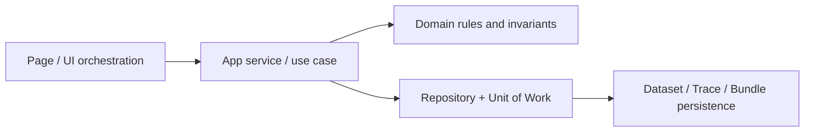

---
aliases:
  - "Clean Architecture"
  - "分層架構"
tags:
  - diataxis/explanation
  - audience/team
  - topic/architecture
  - topic/data
  - topic/ui
status: stable
owner: docs-team
audience: team
scope: "以 page / use case / domain / repository-uow 劃分責任的架構心智模型"
version: v0.2.0
last_updated: 2026-03-06
updated_by: codex
---

# Clean Architecture

本頁描述的不是檔案樹，而是「目前系統如何把責任切開」。
Reference 會定義 UI/data contract；這裡解釋為什麼 page、use case、domain、repository / Unit of Work 要分層。

## Current Flow in One Picture

這個方向對應到目前文件中的頁面契約與資料契約：

- page 層負責 `/schemas/{id}`、`/simulation`、`/characterization` 的互動編排與狀態呈現
- app service / use case 層負責把「格式化、展開、模擬、後處理、分析、保存」串成一次完整流程
- domain 層負責定義哪些語意是 authority，哪些只是 hint
- repository / Unit of Work 層負責把 trace、bundle、derived results 以可追溯方式存下來

## Layer Responsibilities Today

### 1. Page layer

- 管 UI section、selector、feedback 與 page-level state
- 例如 Schema Editor 的 source-form 編輯、Simulation 的結果分區、Characterization 的 trace selection
- 不應在 page 內重新定義資料 authority

這也是為什麼 UI Reference 會明確區分：

- source form vs expanded preview
- raw results vs post-processed results vs sweep view
- dataset-centric surface vs internal bundle provenance

## 2. App service / use case layer

- 接收 page 意圖，協調 parse / validate / expand / run / save 流程
- 決定哪些 domain 規則要在本次操作中被套用
- 把多個 repository 操作包進同一個 transaction / Unit of Work

這一層的價值是不讓頁面自己決定：

- trace 是否相容
- save raw / save post-processed 時 bundle 該如何寫 provenance
- dataset profile 能不能 hard-block run

## 3. Domain layer

domain 真正守的是語意邊界，而不是畫面細節。

### Trace-first authority

- analysis 與 sweep selector 的 authority 在 compatible traces + selected trace ids
- `dataset_profile` 只提供 summary / recommendation
- 因此 UI 可以維持 dataset-centric，但 run 仍由 trace-first 規則決定

### Raw / processed / sweep semantics

- Raw `S` 必須維持 solver-native 語意
- post-processing 產生的是另一個 output node，不可與 raw result 混成一張卡的單一 authority
- sweep 的 canonical authority 在 bundle payload，而不是 UI 為了快速瀏覽投影出的單張 trace

### Source-form boundary

- `Schema Editor` 保存 source form
- expanded preview 與 `/simulation` 的 netlist configuration 都是由同一條 expansion pipeline 得出的 projection
- formatter 可以整理 source text，但不能改寫 netlist 語意

## 4. Repository / Unit of Work layer

- repository 負責讀寫 `DatasetRecord`、`DataRecord`、`ResultBundleRecord`、`ResultBundleDataLink`、`DerivedParameter`
- Unit of Work 保證一次 save/run 內，trace、bundle、link、config snapshot 是同一筆可回放的交易

這就是 bundle / provenance 應該留在這一層的原因：

- provenance 需要和資料一起被原子化保存
- save raw、save post-processed、characterization run 都要留下可追溯來源
- post-process 與 sweep 需要保留 `source_meta` / `config_snapshot` / `result_payload` 才能重建上游輸入

## Why This Split Matters

如果把規則放錯層，常見結果會是：

1. page 直接用 `dataset_profile` 當 hard block，違反 trace-first authority
2. UI 為了方便把 sweep 投影資料當唯一 SoT，失去 canonical payload
3. save 動作只存圖表狀態，不存 bundle provenance，導致結果無法追溯

Clean Architecture 在這個專案的作用，就是把這三種錯誤隔開。

## Read With Reference

- 頁面邊界：
  [Schema Editor](../../../reference/ui/schema-editor.md)、
  [Circuit Simulation](../../../reference/ui/circuit-simulation.md)、
  [Characterization](../../../reference/ui/characterization.md)
- 資料 authority 與 provenance：
  [Data Storage](../data-storage.md)、
  [Dataset Record Schema](../../../reference/data-formats/dataset-record.md)、
  [Analysis Result Schema](../../../reference/data-formats/analysis-result.md)
- repository / Unit of Work 讀寫邊界：
  [Query Indexing Strategy](../../../reference/data-formats/query-indexing-strategy.md)
