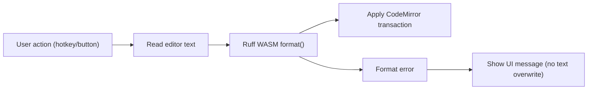

---
aliases:
  - Schema Editor Formatting
  - Schema Editor 格式化策略
tags:
  - diataxis/explanation
  - audience/team
  - topic/architecture
  - topic/visualization
status: draft
owner: docs-team
audience: team
scope: CodeMirror 編輯器的格式化機制選型、Ruff WASM 整合契約與 fallback 策略
version: v0.1.0
last_updated: 2026-02-27
updated_by: docs-team
---

# Schema Editor Formatting

本頁定義 Schema Editor 的程式碼格式化策略，目標是提供「接近 IDE」的使用體驗，同時維持低延遲與可維護性。

## Decision Summary

| 項目 | 決策 |
|---|---|
| Primary Path | `Ruff WebAssembly`（`@astral-sh/ruff-wasm`）在瀏覽器端格式化 |
| Editor | `nicegui.ui.codemirror`（CodeMirror） |
| Trigger | 快捷鍵 + UI Button（例如 `Format`） |
| State Model | 單一 editor 狀態來源，不維護重複字串快取 |
| Failure Behavior | 格式化失敗時保留原文，回報錯誤訊息 |

!!! info "為何選 Ruff WASM"
    可直接在瀏覽器端執行，避免後端 round-trip，對互動式 editor 的體感延遲最低。

## Integration Contract

!!! success "必須滿足的整合契約"
    1. `Format` Button 與快捷鍵必須走同一個 formatter pipeline。
    2. 成功格式化後用同一個 CodeMirror transaction 回寫。
    3. 失敗時不得覆蓋原始內容。
    4. 格式化不應阻塞一般輸入互動。
    5. 格式化結果需可被既有 schema 驗證流程接續使用。

## Fallback Strategy

| 層級 | 觸發條件 | 行為 |
|---|---|---|
| Fallback A | 瀏覽器端 WASM 初始化失敗 | 顯示提示，改走「不自動格式化」模式 |
| Fallback B | 單次 format error | 保留原文 + 顯示錯誤，不中斷編輯 |
| Fallback C (可選) | 專案明確開啟後端格式化 | 呼叫 backend API 執行 `ruff format` |

!!! warning "狀態聲明（截至 2026-02-27）"
    本專案目前尚未在程式碼中完成 Ruff WASM 實裝；本頁記錄的是已確認的目標方案與契約。

## Non-Goals

- 不在 Schema Editor 內實作完整 LSP 功能集（診斷、自動補全、跳轉）。
- 不在此階段引入多種 formatter 並行（避免規則互相覆蓋）。

## Related

- [Tech Stack](../../../reference/guardrails/project-basics/tech-stack.md)
- [Circuit Schema Live Preview](circuit-schema-live-preview.md)
