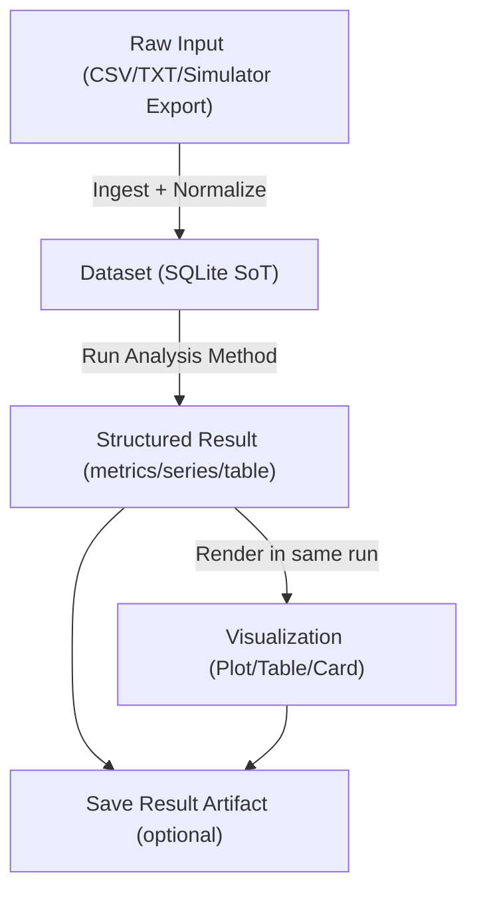

---
aliases:
- Data Flow
- 數據流程
tags:
  - diataxis/explanation
  - status/stable
  - topic/architecture
  - topic/pipeline
  - audience/team
status: stable
owner: docs-team
audience: team
scope: 分析管線的數據流程：Raw -> Dataset -> Analyzed
version: v0.2.0
last_updated: 2026-02-27
updated_by: docs-team
---

# Data Flow

本專案使用「單一分析流程、雙輸出結果」的資料流：每次分析同時產生結構化結果與可視化。

## Pipeline Contracts

### 1. Ingestion Contract

- 輸入來源可以異質（HFSS、VNA、其他模擬輸出）。
- 進入分析前必須先轉為 Dataset Schema（SQLite）以統一欄位與單位。

### 2. Analysis Contract

- 分析方法以 Dataset 為唯一輸入來源（Source of Truth）。
- 每個分析方法回傳結構化結果（例如 metrics、series、table）。

### 3. Visualization Contract

- 視覺化不是獨立管線，而是分析結果的同次渲染。
- UI: 以卡片直接呈現 Plot/Table/Metric。  
  CLI: 以終端摘要 + 圖檔/報表輸出呈現相同分析語意。

### 4. Persistence Contract

- 儲存資料集與儲存分析結果是兩個獨立動作。
- 是否落盤不影響當次可視化顯示，但影響可追溯性與重現性。

!!! warning "不要再做語意切割"
    不論 UI 或 CLI，都不應把「先分析、再另外可視化」當成兩個不連動功能。  
    正確模型是：分析完成時，視覺化也已具備可展示資料。

## Practical Mapping

- UI 的 Characterization 頁面採 registry 驅動，每個 method 直接綁定配置、執行與結果渲染。
- CLI 的 analysis 指令沿用同一分析語意，輸出通道改為終端與檔案。

## Related

- [Raw Data Layout](../../../reference/data-formats/raw-data-layout.md) - 目錄結構
- [Analysis Result](../../../reference/data-formats/analysis-result.md) - 分析輸出格式
- [Preprocessing Rationale](preprocessing-rationale.md) - 為什麼需要中間層
