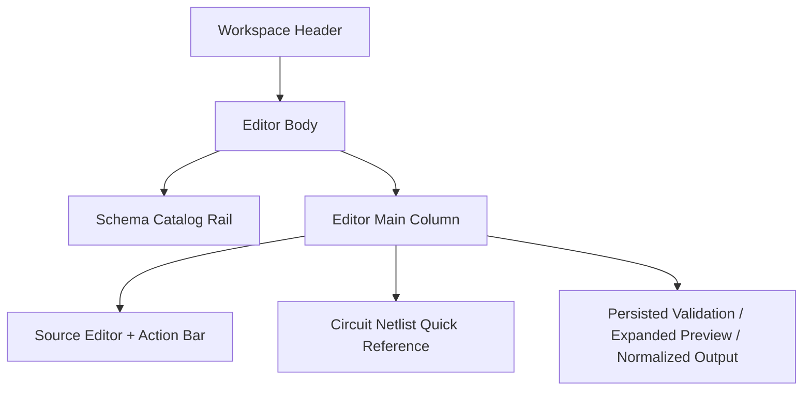

# Schema Editor

本頁定義單一 active circuit schema 的編輯、格式整理、持久化與 persisted preview 契約。

!!! info "Page Frame"
    本頁負責 canonical source 編輯、`Format` / `Save` / `Delete`、persisted validation preview、normalized output 與 schema authoring hints。
    schema list browse、simulation execution、characterization analysis 與 schemdraw render 不屬於本頁責任。

!!! tip "Shared Shell"
    本頁位於 shared [Header](../shared-shell/header.md) / [Sidebar](../shared-shell/sidebar.md) shell 中。
    page body 可顯示 active schema 與 dirty state，但不得接管 global dataset、task queue 或 user menu。

## Purpose

| Responsibility | Meaning |
|---|---|
| Source editing | 直接編輯 canonical circuit netlist source |
| Auto-format | 將 source 整理成 canonical formatting，不隱式儲存 |
| Persisted preview | 顯示最後一次成功儲存後的 validation、expanded preview、normalized output |
| Authoring guidance | 以可掃讀的 quick reference 提示可用元件、unit 與 topology 規則 |

## Layout Structure

## Component Inventory

| ID | Component | Required behavior |
|---|---|---|
| `C1` | Catalog Rail | 在不離開 editor workflow 的情況下切換 active schema |
| `C2` | Source Editor | 編輯 canonical source；需有 syntax highlighting、line numbers、dirty state |
| `C3` | Action Bar | 至少包含 `Format`、`Save`、`Discard`、`Delete` |
| `C4` | Persisted Preview Panel | 顯示 validation notices、expanded preview、normalized output |
| `C5` | Circuit Netlist Quick Reference | 以 table 或 tabs 呈現 component、unit、topology hint |

## Formatting Contract

!!! warning "Auto-format Is Required"
    Code editor 必須支援明確的 auto-format 行為。
    使用者至少要能透過 `Format` 按鈕與 `Cmd/Ctrl + Shift + F` 觸發格式整理。

| Rule | Meaning |
|---|---|
| Explicit action only | `Format` 可以整理 source，但不得隱式觸發 `Save` |
| Canonical shape | 格式化後的 source 應對齊 canonical netlist form，避免 page-local style fork |
| Dirty remains meaningful | `Format` 若改動 source，仍視為未儲存修改，直到 `Save` 成功 |
| Failure feedback | formatter 失敗時，必須給出明確 diagnostics，不可靜默忽略 |

??? example "Expected edit flow"
    1. 使用者修改 source。
    2. 點擊 `Format` 或使用快捷鍵。
    3. editor source 被重排為 canonical style。
    4. dirty state 仍保留。
    5. 只有點擊 `Save` 後，persisted preview 才更新。

## Circuit Netlist Quick Reference

!!! info "Authoring Hint Surface"
    本頁必須直接顯示可掃讀的 hint table。
    使用者不應被迫跳離 editor 才知道元件前綴、單位與 topology 規則。

### Component & Unit Table

| Component | Prefix | Allowed Units | Example | Hint |
|---|---|---|---|---|
| Port | `P*` | `-` | `("P1", "1", "0", 1)` | port index 使用整數 |
| Resistor | `R*` | `Ohm`, `kOhm`, `MOhm` | `("R1", "1", "0", "R1")` | 常見 shunt 為 `50 Ohm` |
| Inductor | `L*` | `H`, `mH`, `uH`, `nH`, `pH` | `("L1", "1", "2", "L1")` | 與 `Lj*` 分開 |
| Capacitor | `C*` | `F`, `mF`, `uF`, `nF`, `pF`, `fF` | `("C1", "1", "2", "C1")` | 共享參數請用 `value_ref` |
| Josephson Junction | `Lj*` | `H`, `mH`, `uH`, `nH`, `pH` | `("Lj1", "2", "0", "Lj1")` | junction symbol 由 preview 顯示 |
| Mutual Coupling | `K*` | project-specific | `("K1", "L1", "L2", "K1")` | topology 第 2/3 欄是 inductor name |

### Authoring Rules

| Rule | Meaning |
|---|---|
| `components` first | 元件定義必須先存在，`topology` 再引用元件名稱 |
| Ground token | 地只允許字串 `0` |
| Topology references names | 非 Port 元件在 topology 中應引用 component name |
| Hints are reference-only | quick reference 幫助撰寫，但 canonical truth 仍以 [Circuit Netlist](../../../data-formats/circuit-netlist.md) 為準 |

## Data & State Contract

=== "Read model"

    | Data | Source | Why it matters |
    |---|---|---|
    | definition detail | definition service | 填充 editor 與 page identity |
    | validation notices | persisted definition detail | 顯示 save 後的 validation result |
    | expanded preview | persisted preview payload | 讓使用者檢查 repeat-expansion 後結果 |
    | normalized output | persisted preview payload | 顯示後端派生 canonical output |

=== "Page states"

    | State | Meaning |
    |---|---|
    | `Dirty` | editor source 與 persisted preview 已脫鉤 |
    | `Formatting` | formatter 執行中 |
    | `Saving` | save mutation 執行中 |
    | `Persisted` | editor 與 persisted preview 對齊 |

!!! warning "Persisted Preview Boundary"
    `Validation Notices`、`Expanded Preview` 與 `Normalized Output` 必須綁定最後一次成功儲存的版本。
    未儲存內容不能直接覆寫 preview authority。

## Acceptance Checklist

!!! success "Implementation-ready outcome"
    * [ ] editor 有 `Format` 按鈕與 `Cmd/Ctrl + Shift + F`
    * [ ] `Format` 不會隱式 `Save`
    * [ ] dirty / formatting / saving / persisted 狀態可辨識
    * [ ] page body 顯示 `Circuit Netlist Quick Reference`
    * [ ] quick reference 至少含 component / units / topology rules
    * [ ] persisted preview 與未儲存 draft 明確分離

## Related

* [Schemas](schemas.md)
* [Circuit Netlist](../../../data-formats/circuit-netlist.md)
* [Backend / Circuit Definitions](../../backend/circuit-definitions.md)
* [Header](../shared-shell/header.md)
* [Sidebar](../shared-shell/sidebar.md)
