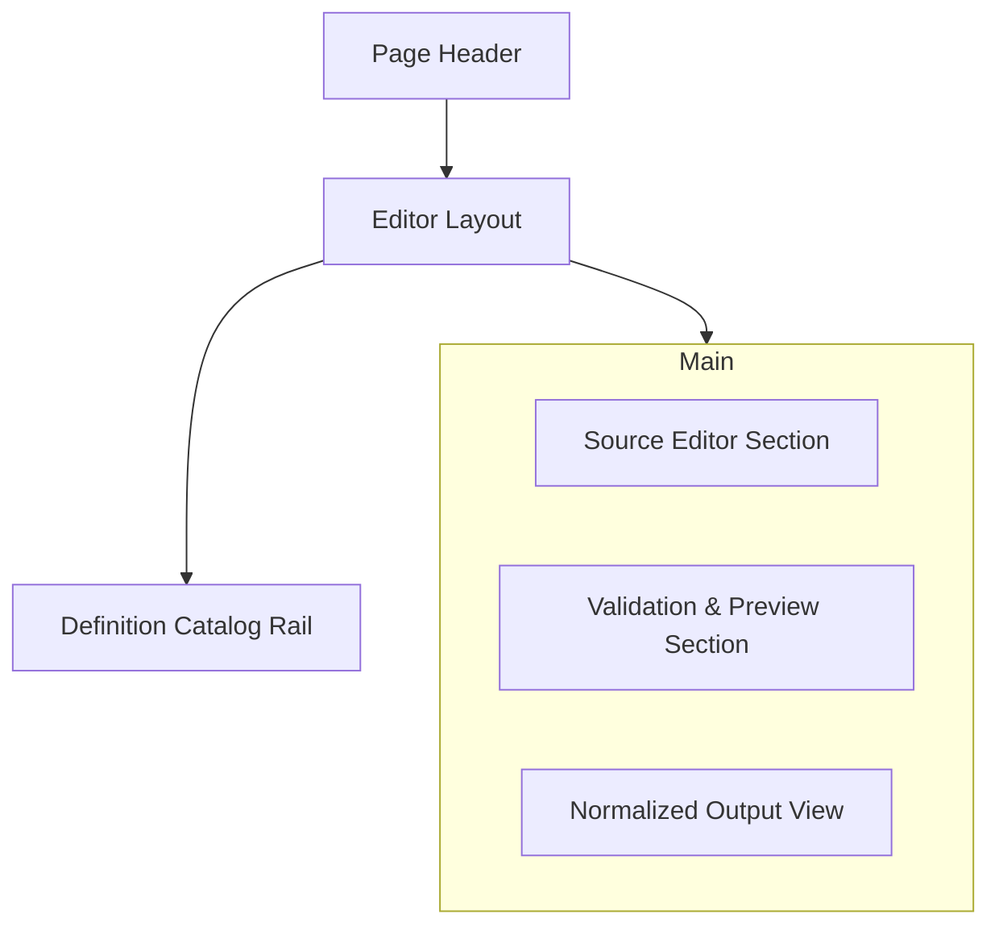

# Schema Editor

本頁負責單一 Active Circuit Schema 的編輯、預覽與持久化管理流程。

!!! info "Page Frame"
    本頁負責 active schema source 編輯、format / save / delete、persisted validation preview 與 normalized output 檢視。
    schema list browse、simulation execution 與 characterization run 不屬於本頁責任。

---

## 核心職責

=== "編輯與管理"
    *   **Source Form**: 編輯電路定義、修改 Schema 名稱。
    *   **代碼整理**: 支援 Definition Source 的格式化 (Format)。
    *   **生命週期**: 執行建立 (New)、儲存 (Save) 與刪除 (Delete) 模式。
    *   **工作流切換**: 在 Editor 內直接切換不同的 Active Schema。

=== "預覽與驗證"
    *   **Validation Feedback**: 檢視由後端最後一次儲存後產生的驗證回饋。
    *   **Derived Output**: 檢視正規化後的輸出 (Normalized Output) 與展開預覽 (Expanded Preview)。
    *   **Artifact Summary**: 檢視關聯的預覽產物列表。

---

## 使用者目標 (User Goals)

1.  **快速啟用**: 隨時切換或建立新的 Definition。
2.  **精確編輯**: 透過代碼編輯器修改物理網表與名稱。
3.  **即時回饋**: 確認最新的 Persisted Validation 是否符合規格。
4.  **下游審查**: 判斷 Schema 是否已準備好交給 Simulation 或後續分析。

---

## UI 配置與 組件清單

### 佈局結構 (Layout Hierarchy)

### 組件清單 (Components)

| ID | 組件名稱 | 類型 | 功能 |
| :--- | :--- | :--- | :--- |
| **C1** | Catalog Rail | Sidebar Rail | 無縫切換 Active Schema，不離開編輯工作流。 |
| **C2** | Source Editor | Monaco/CodeMirror | 編輯 Canonical Source Form，支援語法高亮。 |
| **C3** | Action Bar | Buttons | 提供 `Save`, `Format`, `Discard`, `Delete` 操作。 |
| **C4** | Preview Panel | Data View | 顯示最後一次成功儲存後的驗證通知與結果。 |
| **C5** | Normalized View | Read-only Code | 顯示後端派生的正規化輸出，禁止反向寫回。 |

---

## 資料與狀態契約

=== "數據依賴 (Data Dependencies)"
    | 資料名稱 | 來源 | 必要性 | 用途 |
    | :--- | :--- | :---: | :--- |
    | definition detail | definition service | ✅ | 填充 Editor 與 Preview 區塊。 |
    | validation notices | persisted detail | ✅ | 顯示警告 (Warnings) 與檢查項目。 |
    | mutation result | definition mutation | ✅ | 儲存後刷新數據與清單。 |

=== "頁面狀態 (States)"
    | 狀態 | 說明 |
    | :--- | :--- |
    | `Dirty` | 偵測到未儲存修改，Preview 區塊應提示其內容已與 Editor 不同步。 |
    | `Saving` | 正執行持久化操作，暫時停用編輯器。 |
    | `Persisted` | Editor 與 Preview 處於同步狀態。 |

!!! warning "Persisted Preview Boundary"
    `Validation Notices` 與 `Normalized Output` 必須綁定最後一次成功儲存的狀態。
    **未儲存的修改不得直接覆寫預覽面板**，應明確標示當前內容仍為舊版本。

---

## 互動流程 (Interaction Flow)

??? info "流程 A: 編輯與還原 (Edit / Discard)"
    1.  修改內容後，`is_dirty` 變為 True。
    2.  點擊 `Discard` 可還原至最後一次 persisted 版本。
    3.  點擊 `Format` 僅整理排版，**不觸發**隱式儲存。

??? tip "流程 B: 儲存與同步 (Save / Sync)"
    1.  點擊 `Save` → 觸發後端持久化流程。
    2.  成功後，Preview 區域立即更新為最新的後端派生結果。
    3.  重置 `is_dirty` 為 False。

---

## 視覺與響應規範 (Visual Rules)

*   **分欄明確**: Catalog Rail 與 Active Editor 必須清楚分開，避免資訊混淆。
*   **預覽分離**: 預覽區 (Read-only) 與 編輯區 (Editable) 應有顯著的視覺差異。
*   **Dirty 狀態顯著**: 未儲存修改必須在標題或側邊有明確的視覺提示。
*   **語氣一致**: 驗證通知應使用明確的色彩 (Ready: Green, Warning: Amber, Error: Red)。

---

## 相關參考

*   [Schemas List](schemas.md)
*   [Circuit Simulation Workflow](../research-workflow/circuit-simulation.md)
*   [Backend: Circuit Definitions](../../backend/circuit-definitions.md)
*   [Architecture: Schema Editor Formatting](../../../explanation/architecture/design-decisions/schema-editor-formatting.md)
