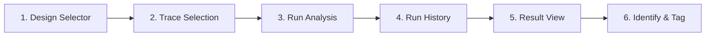

# Characterization

本頁定義 design-scoped characterization workflow 的 analysis selection、trace selection、run history、result view 與 identify mode 契約。

!!! info "Page Frame"
    本頁負責 design scope、compatible traces、analysis run、persisted result inspection 與 identify / tagging。
    raw data ingest、schema editing 與 simulation execution 不屬於本頁責任。

!!! info "Analysis Path"
    本頁遵循嚴格的線性邏輯：
    `選擇 Design` → `選取相容 Traces` → `執行分析 (Run)` → `檢閱持久化結果 (Results)`。

---

## 核心職責

=== "配置與執行"
    *   **範圍定義**: 選擇一個 Design 並檢視其 Source Coverage。
    *   **分析選擇**: 選擇 Analysis 類型並確認與當前 Traces 的相容性。
    *   **任務提交**: 選取多筆 Traces 並啟動 Characterization Run。

=== "結果與標記"
    *   **歷史追蹤**: 檢視過往執行紀錄 (Run History) 與實時日誌 (Log)。
    *   **多維檢視**: 透過 Table 或 Plot 檢視 Result Artifacts。
    *   **參數標記**: 進入 **Identify Mode**，將分析結果標記 (Tag) 回系統核心度量。

---

## UI 佈局與 工作流

### 分析流水線 (Pipeline Flow)

### 關鍵組件清單 (Components)

| ID | 組件名稱 | 位置 | 作用 |
| :--- | :--- | :--- | :--- |
| **C1** | Design Selector | Top | 決定分析的資料邊界與相容性檢查基準。 |
| **C2** | Analysis Selector | Middle | 選擇演算法類型，顯示 `Recommended` 或 `Unavailable`。 |
| **C3** | Trace Selection Table | Middle | 展示 compatible traces，支援 `All` / `Base` / `Clear` 操作。 |
| **C4** | Result View Controls | Bottom | 切換結果類別 (Category) 與產物 (Artifact) 頁籤。 |
| **C5** | Identify & Tag | Bottom | 自動提取參數並執行 Tagging 提交。 |

---

## 狀態與相容性契約 (Contract)

=== "分析可用性 (Availability)"
    | 狀態 | 定義 |
    | :--- | :--- |
    | **Recommended** | 偵測到相容 Traces，且符合專案 Profile 建議。 |
    | **Available** | 具備基礎執行條件 (Traces > 0)。 |
    | **Unavailable** | 當前 Design 範圍內無相容數據。 |

=== "Trace 模式 (Modes)"
    *   **Base**: 基礎掃描數據。
    *   **Sideband**: 側帶或輔助測量數據。
    *   **All**: 包含所有已索引的 Trace 種類。

!!! tip "Profile 只做提示 (Hint)"
    Design Profile 僅作為推薦參考。分析是否可執行的**最終判定**權在於 **Compatible Traces** 的存在與否。

---

## 數據持續性與 運行時規則

*   **Task Attachment**: Run 啟動後，頁面必須自動附加 (Attach) 到對應任務並顯示日誌。
*   **Result Persistence**: 結果檢閱僅依賴持久化的 Artifacts，刷新頁面後必須能精確還原視圖。
*   **非重複計算**: 切換圖表格式 (Table/Plot) 或類別時，僅改變呈現方式，**不重跑**分析。

---

## 相關參考

*   [Raw Data Browser](../workspace/raw-data-browser.md)
*   [Backend: Tasks & Execution](../../backend/tasks-execution.md)
*   [Backend: Characterization Results](../../backend/characterization-results.md)
*   [Data Format: Analysis Result](../../../data-formats/analysis-result.md)
