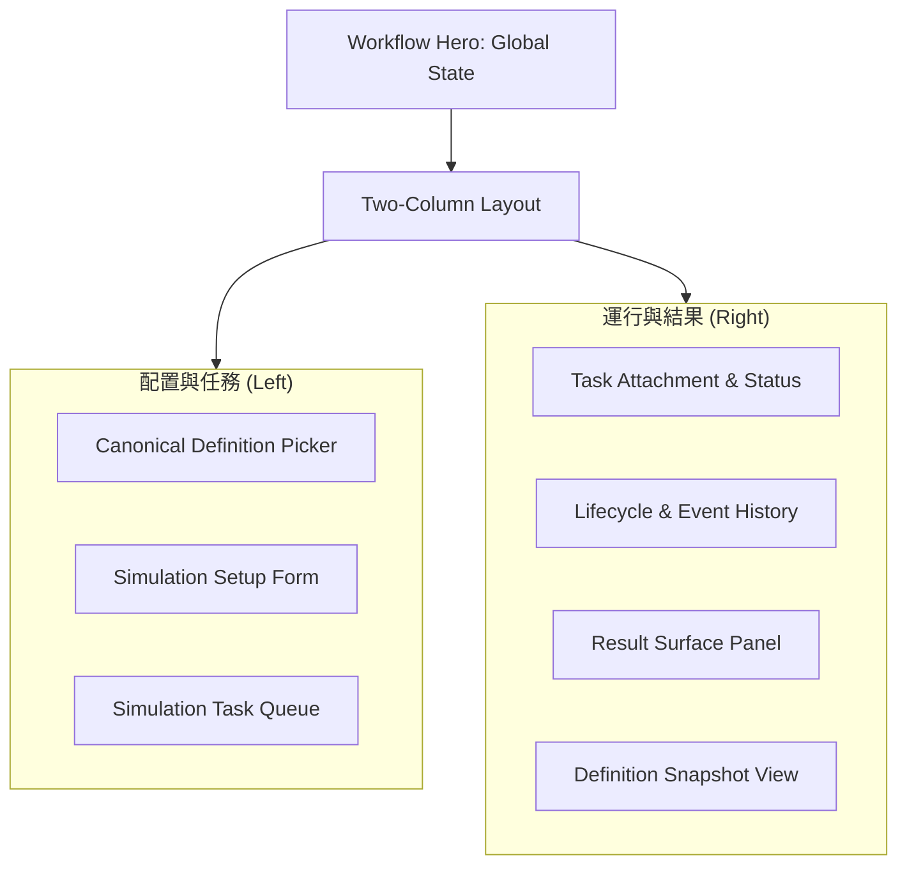

# Circuit Simulation

本頁定義 circuit simulation workflow 的 canonical definition 選擇、simulation setup、task management、result inspection 與 post-processing 契約。

!!! info "Page Frame"
    本頁負責 definition 選擇、simulation setup、task submission / attachment、event history、result review 與 post-processing。
    schema authoring、raw data browse 與 characterization analysis 不屬於本頁責任。

!!! info "Workflow Anchors"
    本頁架構圍繞三個核心對象展開：
    1.  **Canonical Definition**: 模擬的權威電路定義。
    2.  **Active Dataset**: 資料運行的上下文背景。
    3.  **Persisted Task**: 持久化的任務實體，確保刷新後仍可恢復工作狀態。

---

## 核心職責

=== "配置與提交"
    *   **定義選擇**: 選定目標電路，並檢閱其正規化後的網表快照。
    *   **模擬設置**: 配置 Frequency/Parameter Sweeps、Solver Options 與 Sources。
    *   **任務發送**: 提交 Simulation 或 Post-processing 任務。

=== "追蹤與審查"
    *   **任務隊列**: 檢視與過濾最近的模擬任務進度。
    *   **執行歷程**: 追蹤任務從 Dispatch 到 Result 的完整事件鏈。
    *   **結果檢閱**: 在 Raw 與 Post-processed 結果介面間切換，並執行數據分析。

---

## UI 配置與 佈局結構

### 佈局結構 (Layout Structure)

### 關鍵組件清單 (Components)

| ID | 組件 | 功能描述 |
| :--- | :--- | :--- |
| **C1** | Workflow Hero | 顯示目前綁定的 Definition、Dataset 與 Task 狀態。 |
| **C2** | Simulation Setup | 包含 Sweep, Sources, PTC 與 Solver 選項的分組表單。 |
| **C3** | Task Queue | 條列式任務清單，支援搜尋與「點擊 Attach」功能。 |
| **C4** | Lifecycle Panel | 實時反映任務的 Dispatch、Progress 與 Result 狀態。 |
| **C5** | Result Panel | 顯示仿真生成的數據，區分 Raw 與 Post-processing 路徑。 |

---

## 模擬配置契約 (Setup Contract)

!!! warning "Setup vs Definition"
    此處的配置屬於 **"運行參數"**，僅存於 Task Snapshot 中，**不會**回寫至 Circuit Definition 的源碼。

=== "Sweep & Solver"
    *   **Frequency Sweep**: 設定 Start, Stop 與 Points。
    *   **HB Solve**: 設定諧波數量 (Harmonics) 與進階 Solver 容差。
    *   **Parameter Sweeps**: 啟用多軸參數掃描模式。

=== "Sources & PTC"
    *   **Sources**: 設定 Pump 頻率、埠口電流與模式。
    *   **PTC**: 埠口終止補償 (Port Termination Compensation)，僅作用於 `Y/Z` 參數。

---

## 數據與持續性 (Persistence)

=== "數據依賴"
    | 資料 | 來源 | 必要性 |
    | :--- | :--- | :---: |
    | definition detail | definition service | ✅ |
    | task detail & events | task execution bus | ✅ |
    | result refs | persisted output | ✅ |

=== "狀態復原 (Recovery)"
    | 場景 | 預期行為 |
    | :--- | :--- |
    | **頁面刷新** | 應根據 URL 中的 `taskId` 自動重建狀態。 |
    | **任務斷連** | 提供「Attach Latest」按鈕，快速連結回最新的執行任務。 |

!!! warning "PTC 適用範圍"
    **S-parameters** 永遠顯示 Solver 產出的原始值；**PTC** 補償機制僅允許施作於 **Y/Z 參數** 路徑。

---

## 互動流程 (Interaction Flow)

??? example "流程 A: 提交新任務"
    1.  選擇 Definition 與配置 Setup。
    2.  點擊 `Run Simulation` → 建立 **Persisted Task**。
    3.  右側面板自動 Attach 到該 Task，並顯示 `PENDING` 狀態。

??? tip "流程 B: 結果交互 (Result Inspection)"
    1.  當 Task 狀態變為 `SUCCESS`，Result Panel 載入數據摘要。
    2.  切換 Metric 或 Family 時，僅更新視圖內容，**不觸發** Solver 重新運行。

---

## 相關參考

*   [Schemas List](../definition/schemas.md)
*   [Task Semantics](../../architecture/task-semantics.md)
*   [Backend: Tasks & Execution](../../backend/tasks-execution.md)
*   [Backend: Datasets & Results](../../backend/datasets-results.md)
