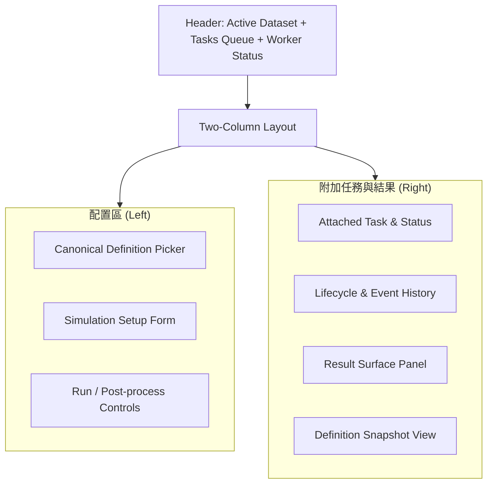

# Circuit Simulation

本頁定義 circuit simulation workflow 的 canonical definition 選擇、simulation setup、task submission / attachment、result inspection 與 post-processing 契約。

!!! info "Page Frame"
    本頁負責 definition 選擇、simulation setup、task submission / attachment、event history、result review 與 post-processing。
    schema authoring、raw data browse 與 characterization analysis 不屬於本頁責任。

!!! info "Workflow Anchors"
    本頁架構圍繞三個核心對象展開：
    1. **Canonical Definition**
    2. **Active Dataset**
    3. **Persisted Task**

!!! tip "Shared Surfaces"
    本頁使用 shared [Header](../shared-shell/header.md)、[Sidebar](../shared-shell/sidebar.md) 與 [Task Management](../shared-workflow/task-management.md)。
    `Tasks Queue` 與 `Worker Status` 由 Header 提供；本頁只負責本次附加任務的細部執行與結果檢閱。

## Shell Context Requirements

| Context | Requirement |
|---|---|
| active workspace | definition 可見性、task queue 與 worker summary 都受其限制 |
| active dataset | submit simulation task 前必須已解析到有效 active dataset，除非明確定義該 lane 可 dataset-null |
| active definition | 必須屬於目前 active workspace 且對 session 可見 |
| attached task | 若 workspace switch 後不再可見，必須解除附著並提示 |

## Workflow Topology

## 關鍵組件清單

| ID | 組件 | 功能描述 |
| :--- | :--- | :--- |
| **C1** | Definition Picker | 顯示目前綁定的 canonical definition。 |
| **C2** | Simulation Setup | 包含 Sweep、Sources、PTC 與 Solver 選項的分組表單。 |
| **C3** | Run Controls | 提交 Simulation 與 Post-processing task。 |
| **C4** | Attached Task Panel | 顯示目前附加 task 的 lifecycle、status、events。 |
| **C5** | Result Panel | 顯示仿真生成的數據，區分 Raw 與 Post-processing 路徑。 |

## 模擬配置契約

!!! warning "Setup vs Definition"
    此處的配置屬於「運行參數」，僅存於 task snapshot 中，不會回寫至 Circuit Definition 的源碼。

=== "Sweep & Solver"
    * **Frequency Sweep**: 設定 Start、Stop 與 Points。
    * **HB Solve**: 設定 Harmonics 與進階 Solver 容差。
    * **Parameter Sweeps**: 啟用多軸參數掃描模式。

=== "Sources & PTC"
    * **Sources**: 設定 Pump 頻率、埠口電流與模式。
    * **PTC**: 埠口終止補償 (Port Termination Compensation)，僅作用於 `Y/Z` 參數。

## 數據與持續性

=== "數據依賴"
    | 資料 | 來源 | 必要性 |
    | :--- | :--- | :---: |
    | definition detail | definition service | ✅ |
    | task detail & events | task execution surface | ✅ |
    | result refs | persisted output | ✅ |
    | active workspace / dataset | session surface | ✅ |
    | capability flags | session surface | ✅ |

=== "狀態復原"
    | 場景 | 預期行為 |
    | :--- | :--- |
    | **頁面刷新** | 根據 `taskId` 自動重建 attached task 狀態。 |
    | **任務斷連** | 透過 Header `Tasks Queue` 或 `Attach Latest` 快速連回最新執行任務。 |

!!! warning "PTC 適用範圍"
    **S-parameters** 永遠顯示 solver 原始值；**PTC** 補償機制僅允許施作於 **Y/Z** 路徑。

## Permission And Gating

| Concern | Rule |
|---|---|
| Submit task | 依 `can_submit_tasks` 與 definition / dataset visibility 決定 |
| Attach / cancel / terminate / retry | 依 shared [Task Management](../shared-workflow/task-management.md) 與 backend `allowed_actions` 決定 |
| No active dataset | 顯示 clear blocking state，不得假設 page-local dataset 足以代替 session context |
| Workspace switch during run | 不停止已存在 task，但本頁若失去可見性需解除附著 |

## 互動流程

??? example "流程 A: 提交新任務"
    1. 選擇 Definition 與配置 Setup。
    2. 點擊 `Run Simulation` → 建立 persisted task。
    3. Header `Tasks Queue` 立即出現新 row 與 worker summary 更新。
    4. 右側面板自動 Attach 到該 task，並顯示 `PENDING` 狀態。

??? example "流程 A2: Workspace 切換後"
    1. Header 切換 active workspace。
    2. 本頁重驗 definition 與 active dataset。
    3. 若舊 attached task 不再可見，右側面板改為 detached state，並要求重新選擇 definition / task。

??? tip "流程 B: 結果交互"
    1. 當 task 狀態變為 terminal，Result Panel 載入 persisted result summary。
    2. 切換 Metric 或 Family 時，僅更新視圖內容，不觸發 solver 重新運行。

## 相關參考

* [Schemas List](../definition/schemas.md)
* [Header](../shared-shell/header.md)
* [Sidebar](../shared-shell/sidebar.md)
* [Task Management](../shared-workflow/task-management.md)
* [Backend: Tasks & Execution](../../backend/tasks-execution.md)
* [Backend: Datasets & Results](../../backend/datasets-results.md)
