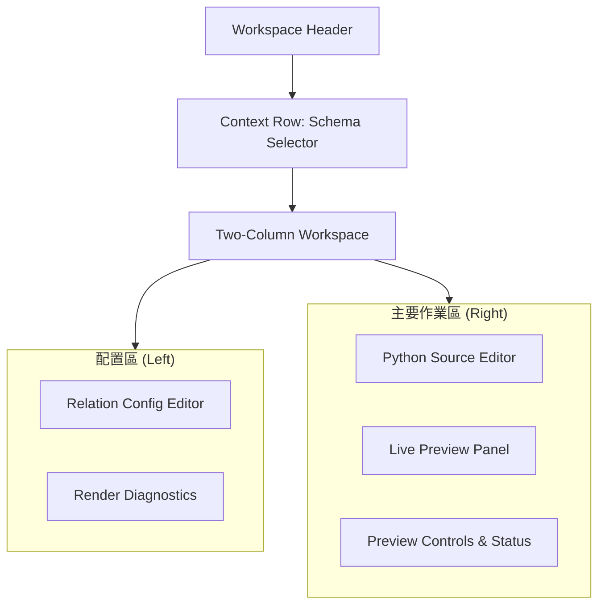

# Schemdraw

本頁定義 Schemdraw workspace 的 live Python editor、relation config、backend render 與 SVG preview 契約。

!!! info "Page Frame"
    本頁負責 linked schema 選取、relation config 編輯、live code feedback、backend render 與 preview diagnostics。
    canonical definition 寫回、simulation task 建立與 result persistence 不屬於本頁責任。

---

## 核心職責

=== "撰寫與配置"
    *   **Python Editor**: 撰寫 Schemdraw Python 代碼。
    *   **Context Linking**: 選項式連結一個 Canonical Circuit Definition。
    *   **Relation Mapping**: 編輯 Relation Config JSON 以定義 Probe 或標註行為。

=== "渲染與預覽"
    *   **Backend Render**: 觸發後端渲染服務取得 SVG。
    *   **Live Preview**: 顯示 SVG 預覽、縮放與平移。
    *   **Diagnostics**: 顯示語法 (Syntax)、驗證 (Validation) 與執行時期 (Runtime) 錯誤。

---

## UI 區態預覽

### 工作區佈局 (Layout)

### 關鍵組件清單 (Components)

| ID | 組件 | 作用 | 關鍵行為 |
| :--- | :--- | :--- | :--- |
| **C1** | Linked Schema Selector | Workspace Header | 選擇要附加的元數據背景電路。 |
| **C2** | Python Source Editor | Right Col | 提供代碼編輯與本地語法檢查。 |
| **C3** | Live Preview Panel | Right Col | 展示最新的渲染結果，支援 `Zoom` 與 `Fit`。 |
| **C4** | Relation Editor | Left Col | 編輯 JSON 組態，驅動渲染中的實體識別。 |
| **C5** | Diagnostics Panel | Left Col | 集中顯示所有層級的錯誤與警告。 |

---

## 數據與服務契約 (Contract)

=== "渲染請求 (Request)"
    | 欄位 | 必要性 | 說明 |
    | :--- | :---: | :--- |
    | `source_text` | ✅ | Schemdraw Python source。 |
    | `relation_config` | ✅ | JSON Object。 |
    | `linked_schema` | ⚠️ | 可選的微縮元數據快照。 |
    | `document_version` | ✅ | 自增版本號，用於解決 Race Condition。 |

=== "渲染回應 (Response)"
    | 欄位 | 說明 |
    | :--- | :--- |
    | `status` | `rendered` / `syntax_error` / `runtime_error` 等。 |
    | `svg` | 渲染成功的圖形標籤。 |
    | `diagnostics` | 結構化的錯誤集合。 |
    | `cursor_position` | 圖筆 (Pen) 最後的座標。 |

!!! tip "Latest-only 原則"
    前端僅會採用與目前 `document_version` 指向一致或更新的渲染結果。若較舊的結果延遲抵達，將被直接丟棄，以確保預覽不回溯。

---

## 互動規則 (Interaction Rules)

??? info "編輯與渲染流 (Edit-to-Render)"
    1.  **代碼變更**: 立即觸發本地 Syntax 檢查，Preview 標記為 `Stale`。
    2.  **Debounce**: 停止輸入後的短延遲自動向後端發送 Render Request。
    3.  **手動干預**: 點擊 `Render Now` 立即強制重新整理。

??? warning "Canonical Boundary"
    在此工作區所作的世界性修改 (Schemdraw Code, Relation JSON) **不得隱式儲存**至 Canonical 定義中。

---

## 運行時註記 (Runtime Notes)

*   **本地反饋優先**: 編輯器必須在 backend 響應前，先根據本地 linter 提供回饋。
*   **請求取消**: 當新 Request 發出時，應盡量 Cancel 尚未完成的舊請求。
*   **Stale 緩衝**: 在新結果返回前，保留舊的 SVG 預覽並覆蓋一層微透的「過時」提示。

---

## 相關參考

*   [Schema editor](../definition/schema-editor.md)
*   [Backend: Schemdraw Render](../../backend/schemdraw-render.md)
*   [Circuit Simulation](circuit-simulation.md)
