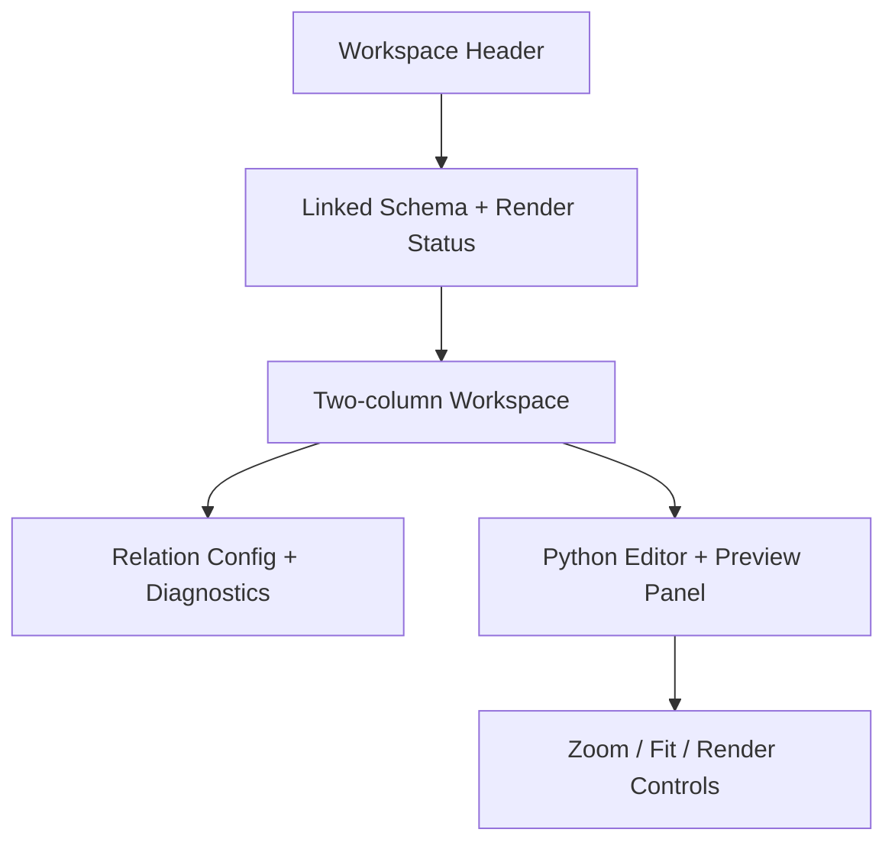

# Schemdraw

本頁定義 Schemdraw workspace 的 editor、relation config、backend syntax check 與 live preview 契約。

!!! info "Page Frame"
    Frontend 只負責編輯 source、編輯 relation config、送出 render request、顯示 diagnostics 與 SVG preview。
    authoritative syntax validation、controlled execution 與 render result 組裝由 backend 擁有。

!!! warning "Backend Owns Live Preview"
    本頁可以有本地 syntax highlighting、cursor helpers 與 basic editor cues；
    但正式的 syntax check、runtime validation 與 SVG live preview authority 必須來自 backend render service。

## Purpose

| Responsibility | Meaning |
|---|---|
| Python source editing | 使用者在 code editor 中撰寫 Schemdraw Python source |
| Relation config editing | 編輯 relation JSON 作為 schema metadata / labels / probe context |
| Linked schema context | 可選地附加 canonical schema metadata |
| Backend validation & preview | 將 source snapshot 送往 backend，回收 diagnostics 與 SVG |

## Layout Structure

## Component Inventory

| ID | Component | Required behavior |
|---|---|---|
| `C1` | Linked Schema Selector | 選擇可附加的 schema metadata context |
| `C2` | Relation Config Editor | 編輯 JSON relation config |
| `C3` | Python Source Editor | 編輯 Schemdraw Python source |
| `C4` | Render Controls | 至少包含 `Render Now`、`Reset Template` |
| `C5` | Diagnostics Panel | 顯示 backend diagnostics 與 render status |
| `C6` | SVG Preview Panel | 顯示最新成功 render 的 SVG 與 preview metadata |

## Three-step Processing Flow

!!! tip "正式流程"
    Schemdraw live preview 應被視為三步驟流程，而不是單一 editor 小技巧。

1. **Edit locally**
   前端更新 Python source、relation config、linked schema context。
2. **Send snapshot**
   停止輸入後以 debounce 方式送出 request snapshot；手動點擊 `Render Now` 可跳過 debounce。
3. **Validate and render on backend**
   backend 進行 syntax validation、entrypoint validation、controlled render execution，最後回傳 diagnostics 與 SVG。

## Frontend Rules

| Rule | Meaning |
|---|---|
| Local cues are lightweight | editor 可做 syntax highlighting、indent guides、cursor hints |
| Preview becomes stale on edit | 任何 source / relation 變動都應把 preview 標為 `Stale` |
| Latest-only apply | 前端只採用最新 `document_version` / `request_id` 的 response |
| No implicit persistence | 本頁不保存 schema source、不保存 render draft |

??? example "Edit-to-preview behavior"
    1. 使用者修改 Python source。
    2. editor 立即顯示本地 cue，preview 狀態轉為 `Stale`。
    3. debounce 後送出 render request。
    4. backend 回傳 `rendered` / `syntax_error` / `runtime_error`。
    5. 前端更新 diagnostics；只有成功時替換 SVG。

## Runtime States

| State | Meaning |
|---|---|
| `Editing` | editor 內容變動中 |
| `Stale Preview` | 當前 SVG 仍是舊版本 |
| `Validating` | backend 正在做 syntax / request / relation validation |
| `Rendering` | backend 正在 controlled render |
| `Rendered` | 最新 SVG 已可用 |
| `Syntax Error` | backend 判定 source 無法 parse 或不符合 entrypoint contract |
| `Runtime Error` | syntax 正常，但 render execution 失敗 |

## Authority Pair

| Concern | Authority |
|---|---|
| linked schema metadata | [Backend / Circuit Definitions](../../backend/circuit-definitions.md) |
| render transport / diagnostics / SVG envelope | [Backend / Schemdraw Render](../../backend/schemdraw-render.md) |
| shell context | [Header](../shared-shell/header.md), [Sidebar](../shared-shell/sidebar.md) |

## Acceptance Checklist

!!! success "Implementation-ready outcome"
    * [ ] frontend 只負責 source / relation 編輯與 response 呈現
    * [ ] backend 擁有 authoritative syntax check 與 live preview
    * [ ] three-step flow 已明確：edit -> send snapshot -> backend validate/render
    * [ ] stale preview 與 latest-only apply 有正式定義
    * [ ] page 不會把 preview workflow誤寫成 task queue 或 persistence workflow

## Related

* [Backend / Schemdraw Render](../../backend/schemdraw-render.md)
* [Schema Editor](../definition/schema-editor.md)
* [Header](../shared-shell/header.md)
* [Sidebar](../shared-shell/sidebar.md)
