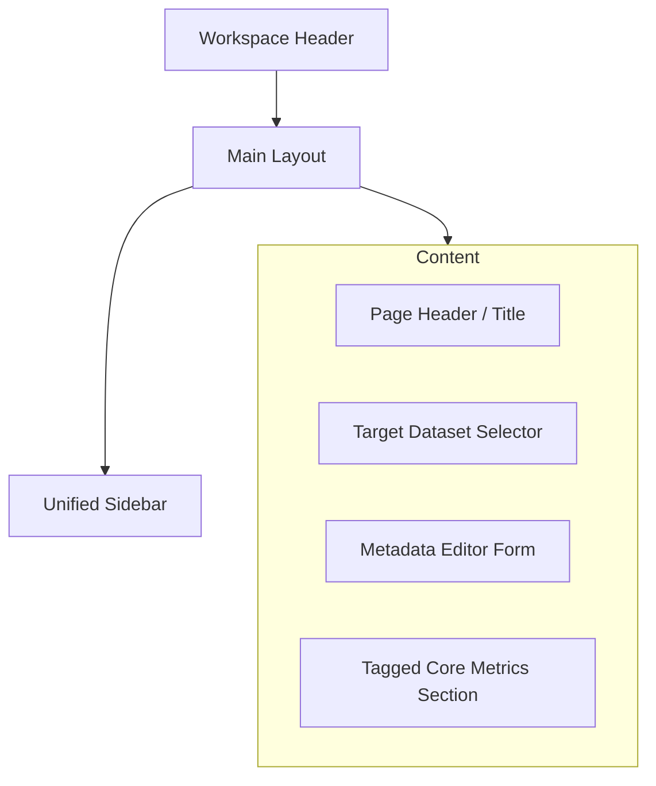

---
aliases:
- Dashboard UI
- Pipeline Dashboard
tags:
- diataxis/reference
- audience/team
- sot/true
- topic/ui
page_id: app.page.dashboard
route: /dashboard
status: draft
owner: docs-team
audience: team
scope: Pipeline /dashboard 的資料摘要與 Dataset Metadata 單一編輯入口契約
version: v0.4.0
last_updated: 2026-03-13
updated_by: team
---

# Dashboard

本頁為 pipeline workspace 的核心數據摘要與 Dataset Metadata 單一編輯入口。

!!! info "Page Frame"
    本頁負責 active dataset 選擇、dataset metadata 編輯、tagged core metrics 摘要與後續操作指引。
    raw data browse、analysis execution、simulation execution 不屬於本頁責任。

---

## 核心職責

=== "負責事項"
    *   **資料導航**: 選擇 Active Dataset。
    *   **定義物理量**: 編輯 Device Type、Capabilities 等 Dataset Profile。
    *   **狀態監測**: 顯示 Dataset Metadata 摘要與已標記的關鍵度量 (Tagged Core Metrics)。
    *   **流程指引**: 提供前往 `Characterization` / `Identify Mode` 的後續操作建議。

=== "非職責範圍"
    *   ❌ 不提供 Raw Trace 瀏覽。
    *   ❌ 不處理 Simulation 或 Characterization 的詳細配置與執行。
    *   ❌ 不提供 Result 的細節預覽。

!!! warning "單一編輯入口規範"
    Dataset Metadata 的正式可寫入口**僅限於 `/dashboard`**。其他頁面僅提供唯讀摘要，不得提供等價的寫入互動。

---

## 使用者目標 (User Goals)

1.  **環境確認**: 明確目前運作中的 Active Dataset 為何。
2.  **硬體定義**: 修改 Device Type 與相關 Capabilities 以符合物理現況。
3.  **效率提升**: 使用 `Auto Suggest` 自動產生建議的 Profile 參數。
4.  **成果確認**: 快速檢視當前 Dataset 已有的 Tagged Core Metrics 標記完成度。

---

## UI 與 組件規格

### 頁面結構 (Layout)

### 組件清單 (Components)

| ID | 元件名稱 | 位置 | 作用 |
| :--- | :--- | :--- | :--- |
| **C1** | Target Dataset Selector | Page Top | 切換 Active Dataset 並刷新表單數據。 |
| **C2** | Metadata Summary Text | Editor Area | 顯示 Device、Capabilities 與 Source 摘要。 |
| **C3** | Device Type Field | Form | 編輯 Dataset Profile 的 Device Type。 |
| **C4** | Capabilities Field | Form | 透過 Multi-select 編輯硬體實力。 |
| **C5** | Action Buttons | Form | 提供 `Auto Suggest` (Secondary) 與 `Save` (Primary)。 |
| **C6** | Tagged Core Metrics | Page Bottom | 以唯讀卡片形式顯示關鍵標記參數。 |

---

## 資料與狀態契約 (Contract)

=== "數據依賴 (Data Dependencies)"
    | 資料名稱 | 來源 | 必要性 | 用途 |
    | :--- | :--- | :---: | :--- |
    | active dataset summary | session / workspace | ✅ | 切換 Target Dataset。 |
    | dataset profile detail | dataset profile service | ✅ | 填充 Metadata 表單。 |
    | tagged core metrics | derived metric service | ⚠️ | 顯示唯讀摘要。 |
    | mutation response | dataset mutation bus | ✅ | 處理儲存反饋。 |

=== "頁面狀態 (States)"
    | 狀態 | 視覺表現 |
    | :--- | :--- |
    | `Default` | 正常顯示 Selector 與 Form。 |
    | `Loading` | Dataset Profile 請求中，Form 呈現 Skeleton 狀態。 |
    | `Empty` | Dataset 存在但尚未進行 `Identify Mode` 標記 (顯示指引)。 |
    | `Error` | 讀取或儲存失敗，顯示全域錯誤回饋。 |

!!! tip "Empty State 指引"
    當 `Tagged Core Metrics` 為空時，頁面必須提供明確的連結，指引使用者前往 `Characterization` 頁面執行 `Identify Mode`。

---

## 互動流程 (Interaction)

??? info "流程 A: 切換 Target Dataset"
    1.  使用者於 C1 選擇新 Dataset。
    2.  Metadata Form 與 Tagged Metrics 進入 Loading。
    3.  成功後，頁面 context 更新為新 Dataset。

??? tip "流程 B: Auto Suggest 與儲存"
    1.  點擊 `Auto Suggest`: 系統由 backend 取得建議並填入 Form，此時為 Dirty State。
    2.  點擊 `Save Metadata`: 提交 Mutation，成功後即時反映至全站 Session。

---

## 驗證檢查清單 (Acceptance Checklist)

- [ ] 是否提供完整的 Dataset Selector、Device Type 與 Capabilities 編輯？
- [ ] 儲存成功後，Session 中的 Profile 是否立即同步更新？
- [ ] Tagged Metrics 是否以**唯讀**方式顯示？
- [ ] 在無標記數據時，是否有明確指引前往 `Identify Mode`？
- [ ] 確認 `/dashboard` 是唯一的 Metadata 寫入路徑？

---

## 相關參考

*   [Raw Data Browser](raw-data-browser.md)
*   [Circuit Simulation](../research-workflow/circuit-simulation.md)
*   [Backend: Session & Workspace](../../backend/session-workspace.md)
*   [Backend: Datasets & Results](../../backend/datasets-results.md)
