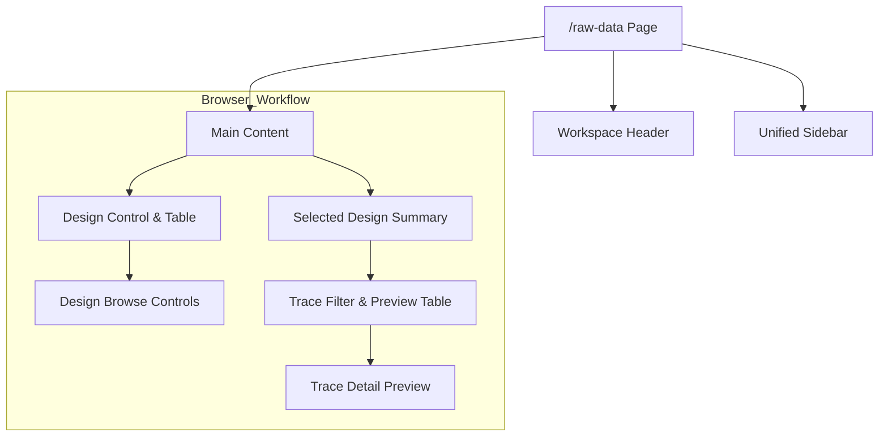

# Raw Data Browser

本頁為 Raw Data Designs 與 Trace Preview 的中心瀏覽工作區。

!!! info "Page Frame"
    本頁負責 design list、trace filtering、compare readiness 與單筆 trace preview。
    raw data upload、dataset metadata 編輯、analysis execution 不屬於本頁責任。

!!! tip "Shared Shell"
    本頁使用 shared [Header](../shared-shell/header.md) 與 [Sidebar](../shared-shell/sidebar.md)。
    selected design context 是 page-local，但 active dataset context 仍由 shared shell 提供。

!!! warning "Dataset-local design scope"
    本頁選擇的是 active dataset 內的 `design_id`。
    design row 不能取代 active dataset，也不能跨出目前 dataset 單獨存在。

---

## 核心職責

=== "負責事項"
    *   **Design 管理**: 瀏覽、搜尋、排序與 cursor-based browse Raw Data Designs。
    *   **Trace 索引**: 依名稱、類型、表現形式 (Representation) 過濾 Traces。
    *   **狀態判斷**: 顯示 Design-level 的 Read-only Summary 與對比就緒度 (Compare Readiness)。
    *   **預覽入口**: 提供單筆 Trace 的內容預覽。

=== "非職責範圍"
    *   ❌ 不處理 Simulation 設定、Schema 編輯或分析執行。
    *   ❌ 不處理 Raw Data 的建立、上傳或 Metadata 編輯。

!!! tip "效能關鍵"
    本頁嚴格遵守 **Summary-only** 原則。在列表階段，**禁止**預載任何大規模的數值載荷 (Numeric Payload)。

---

## 頁面結構與 UI 分層

### UI 層次結構 (UI Tree)

### 關鍵組件清單 (Components)

| ID | 元件名稱 | 分位 | 關鍵行為 |
| :--- | :--- | :--- | :--- |
| **C1** | Designs Table | 上半部 | 支援 row select、欄位排序；僅顯示摘要。 |
| **C2** | Design Summary | 中間層 | 顯示目前 Design 的 Compare Readiness 與 Provenance。 |
| **C3** | Trace Preview Table | 下半部 | 顯示選中 Design 的 Trace Metadata (ID, Type, Repr 等)。 |
| **C4** | Detail Preview | 最底部 | **僅在選定單筆 Trace 後**，才透過專用路徑抓取數據預覽。 |
| **C5** | Browse Controls | Table 附近 | 以前後 cursor 驅動 design / trace list 段落切換。 |

---

## 資料依賴與狀態規範

### 狀態管理 (States)

| 狀態 (State) | 定義與條件 |
| :--- | :--- |
| `Ready` | **Compare Readiness**: 同一 Design 內至少有兩種可區分 Source Traces。 |
| `Inspect Only` | 目前只有單一 Source，適用於個別檢閱。 |
| `Blocked` | 缺少 Trace-first 對比所需的最小條件。 |

### UI 異常狀態

=== "Loading & Error"
    *   **Loading**: 當 Design List 或 Trace Preview 載入時。
    *   **Error**: 查詢失敗時，錯誤訊息應侷限於受影響區域 (例如：Detail 失敗，不影響 Table)。

=== "Empty State"
    *   **Designs Empty**: 顯示導向教學或 Dashboard 的提示。
    *   **Selection Empty**: 提示使用者從列表中選擇一個項目。

---

## 交互流程 (Interaction Flows)

??? example "流程 A: 搜尋與選取 Design"
    1.  使用者輸入關鍵字，`design_query` 更新，Table 刷新。
    2.  點擊 Row 後，`selected_design_id` 更新。
    3.  觸發 `Selected Design Summary` 與 `Trace Preview List` 的異步載入。

??? tip "流程 B: Trace 延時預覽 (Lazy Preview)"
    1.  在 Trace Table 中點選單列。
    2.  系統執行 **Trace Detail Path** 請求。
    3.  此時才進行大數據載體 (Numeric Payload) 的單筆預覽，避免阻塞列表效能。

---

## 視覺與響應規範 (Visual Rules)

| 項目 | 規則 |
| :--- | :--- |
| **Table First** | 優先以表格呈現，避免將頁面變成混亂的卡片堆疊。 |
| **Hierarchy** | 遵守「選 Design → 選 Trace → 看內容」的垂直流向。 |
| **Visibility** | Compare Readiness 等關鍵判斷指標應比一般中繼資料更醒目。 |

!!! warning "唯讀限制"
    本頁僅顯示**唯讀**的 Design Summary。所有 Dataset Metadata 的修改必須回到 [Dashboard](dashboard.md)。

---

## 相關參考

*   [Dashboard](dashboard.md)
*   [Header](../shared-shell/header.md)
*   [Sidebar](../shared-shell/sidebar.md)
*   [Backend: Datasets & Results](../../backend/datasets-results.md)
*   [Record Schema](../../../data-formats/dataset-record.md)
*   [Characterization](../research-workflow/characterization.md)
