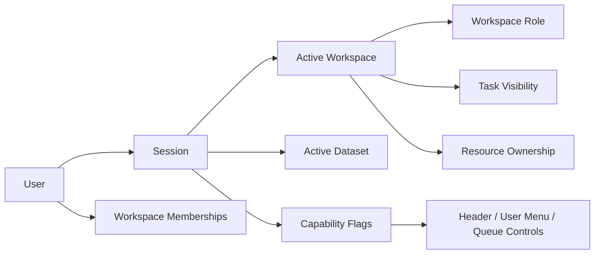

---
aliases:
  - "Identity Workspace Model"
  - "身分與工作空間模型"
tags:
  - diataxis/reference
  - audience/team
  - sot/true
  - topic/app-reference
status: draft
owner: docs-team
audience: team
scope: user / session / workspace / role / active workspace / active dataset / task visibility 的 app 共享模型
version: v0.1.0
last_updated: 2026-03-14
updated_by: team
---

# Identity & Workspace Model

本文件定義 App shared model 中的最小 identity 與 workspace 語意。

!!! info "App-level ownership"
    這份文件回答的是 App collaboration model。
    它同時服務 shared header、shared task queue、backend session surface 與 resource visibility。

!!! warning "Session owns active context"
    `Session` 是 active workspace、active dataset、user summary 與 capability exposure 的 canonical owner。
    frontend local state 可以 cache UI state，但不得重新定義身份與權限 truth。

## Core Terms

| Term | Minimal meaning |
|---|---|
| `User` | 一個可被識別、可被授權的操作者 |
| `Session` | 綁定 `user`、`active workspace`、`active dataset` 與 `capabilities` 的有效上下文 |
| `Workspace` | task visibility、dataset context、resource ownership 與 collaboration 的共享邊界 |
| `Workspace Role` | `owner`、`member`、`viewer` 等 workspace-scoped role |
| `Active Workspace` | session 目前正在操作的單一 workspace |
| `Active Dataset` | 目前 workflow 預設作用的 dataset context |
| `Task Visibility` | 哪些 persisted tasks 對哪些 session / workspace 可見 |

## Authority Rules

=== "Session"

    | Rule | Meaning |
    |---|---|
    | User may join multiple workspaces | membership 可以是多個 |
    | One active workspace per session | 同一時間 session 只綁定一個 active workspace |
    | Session owns dataset context | active dataset 不是 page-local state |
    | Session exposes capability summary | pages 不應自行推斷 permission |

=== "Workspace"

    | Rule | Meaning |
    |---|---|
    | Resources belong to one workspace | dataset / schema / task / result 只掛一個 `workspace_id` |
    | Role is workspace-scoped | 同一 user 在不同 workspace 可有不同 role |
    | Visibility is backend-enforced | queue visibility 不能只靠前端過濾 |
    | Cross-workspace sharing is explicit | 跨 workspace 應用 export/import 或 future publish/copy，不做多重掛載 |

## Relationship Model

## Related

* [Resource Ownership & Visibility](resource-ownership-and-visibility.md)
* [Authentication & Authorization](authentication-and-authorization.md)
* [Backend / Session & Workspace](../backend/session-workspace.md)
* [Frontend / Header](../frontend/shared-shell/header.md)
