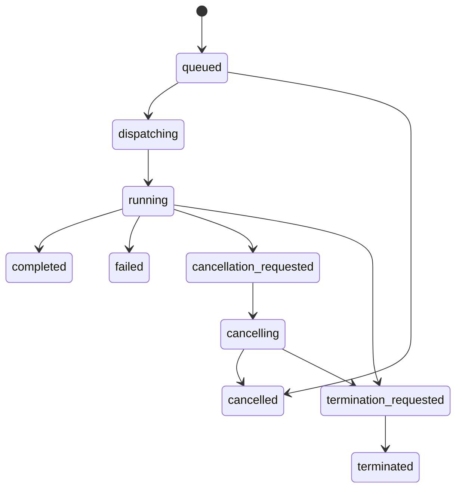
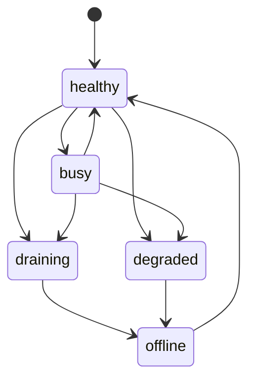

---
aliases:
  - Task Runtime and Processors
  - Worker Runtime
  - 任務執行時與處理器
tags:
  - diataxis/reference
  - audience/team
  - sot/true
  - topic/app-reference
status: draft
owner: docs-team
audience: team
scope: worker / processor health、task state machine、cancel / terminate / retry runtime contract
version: v0.3.0
last_updated: 2026-03-14
updated_by: team
---

# Task Runtime & Processors

本頁定義 app shared task runtime、worker / processor status summary，以及 cancel / terminate / retry 的 shared contract。

!!! info "Header Pairing"
    Header 中的 task queue 必須能直接看到 worker / processor 狀態摘要。

!!! warning "Graceful Cancel 與 Force Terminate 必須分開"
    `Cancel` 與 `Terminate` 不是同一個動作。

## Processor Summary Contract

| Field | Meaning |
|---|---|
| `lane` | `simulation`、`characterization`、`post_processing` 等 lane |
| `healthy_processors` | 可接任務且 heartbeat 正常的 processors 數量 |
| `busy_processors` | 目前正在執行 task 的 processors 數量 |
| `degraded_processors` | heartbeat 仍有回應但狀態不穩定的 processors 數量 |
| `draining_processors` | 不再接新任務、等待現有任務結束的 processors 數量 |
| `offline_processors` | heartbeat 超時或已下線的 processors 數量 |

## Processor Heartbeat Contract

| Field | Meaning |
|---|---|
| `processor_id` | 單一 processor / worker identity |
| `lane` | 該 processor 服務的 workflow lane |
| `state` | `healthy`, `busy`, `degraded`, `draining`, `offline` |
| `current_task_id` | 若正在執行 task，指出目前 task |
| `last_heartbeat_at` | 最近一次 heartbeat 時間 |
| `runtime_metadata` | redaction-safe 的 capacity / version / host summary |

## Task Runtime State Machine

## Control Escalation Rules

| Action | Expected behavior |
|---|---|
| `cancel` | processor 應進入 graceful stop path，先嘗試結束目前 work unit |
| `terminate` | processor 應立即中止 work unit，不再保證 partial output 可用 |
| cancel-to-terminate escalation | 若 task 長時間停在 `cancellation_requested` / `cancelling`，`owner` 或 `admin` 可升級到 `terminate` |
| retry | 只建立新 task；不得覆寫舊 task 的 terminal record |

## Control Request Delivery

| Rule | Meaning |
|---|---|
| Control request is persisted first | `cancel` / `terminate` 先寫入 persisted control state，再由 processor 消費 |
| Processor must ack via task state | worker 不回傳 UI-only signal，而是以 persisted task transition 表示已接收 |
| Queue row reflects request immediately | Header queue 應先看到 control-request state，再等待 terminal state |
| Runtime may reject stale control | 若 task 已 terminal，runtime 應回傳穩定 rejection reason |

## Processor Lifecycle

| Processor state | Meaning |
|---|---|
| `healthy` | heartbeat 正常，可接新 task |
| `busy` | 正在執行 task |
| `degraded` | heartbeat 尚可，但 runtime 狀態異常 |
| `draining` | 不再接新 task，等待現有 task 結束 |
| `offline` | heartbeat 超時或已下線 |

## Processor State Transitions

## Runtime Delivery Rules

| Rule | Meaning |
|---|---|
| Queue summary follows persisted task state | Header 與 task detail 必須能從 persisted state 重建 |
| Processor summary is lane-scoped | summary 需按 lane 聚合，而不是只給全域總數 |
| Cancel and terminate are auditable | 兩者都必須進 audit trail |
| Terminal states stay immutable | `completed` / `failed` / `cancelled` / `terminated` 不可被覆寫成其他 terminal state |

## Related

* [Authentication & Authorization](authentication-and-authorization.md)
* [Audit Logging](audit-logging.md)
* [Backend / Tasks & Execution](../backend/tasks-execution.md)
* [Frontend / Task Management](../frontend/shared-workflow/task-management.md)
