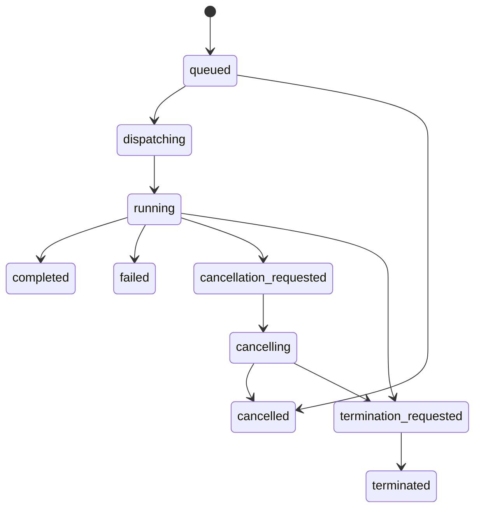

---
aliases:
  - Task Runtime and Processors
  - Worker Runtime
  - 任務執行時與處理器
tags:
  - diataxis/reference
  - audience/team
  - sot/true
  - topic/app-reference
status: draft
owner: docs-team
audience: team
scope: worker / processor health、task state machine、cancel / terminate / retry runtime contract
version: v0.1.0
last_updated: 2026-03-14
updated_by: team
---

# Task Runtime & Processors

本頁定義 app shared task runtime、worker / processor status summary，以及 cancel / terminate / retry 的 shared contract。

!!! info "Header Pairing"
    Header 中的 task queue 必須能直接看到 worker / processor 狀態摘要。

!!! warning "Graceful Cancel 與 Force Terminate 必須分開"
    `Cancel` 與 `Terminate` 不是同一個動作。

## Processor Summary Contract

| Field | Meaning |
|---|---|
| `lane` | `simulation`、`characterization`、`post_processing` 等 lane |
| `healthy_processors` | 可接任務且 heartbeat 正常的 processors 數量 |
| `busy_processors` | 目前正在執行 task 的 processors 數量 |
| `degraded_processors` | heartbeat 仍有回應但狀態不穩定的 processors 數量 |
| `draining_processors` | 不再接新任務、等待現有任務結束的 processors 數量 |
| `offline_processors` | heartbeat 超時或已下線的 processors 數量 |

## Task Runtime State Machine

## Related

* [Authentication & Authorization](authentication-and-authorization.md)
* [Audit Logging](audit-logging.md)
* [Backend / Tasks & Execution](../backend/tasks-execution.md)
* [Frontend / Task Management](../frontend/shared-workflow/task-management.md)
