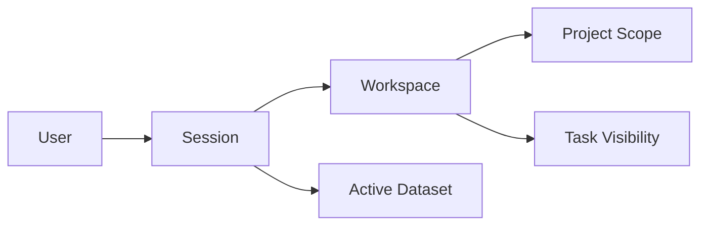

---
aliases:
  - "Identity Workspace Model"
  - "身分與工作空間模型"
tags:
  - diataxis/reference
  - audience/team
  - sot/true
  - topic/architecture
status: draft
owner: docs-team
audience: team
scope: "定義 user/session/workspace/project scope/active dataset/task visibility 的最小語意模型"
version: v0.2.0
last_updated: 2026-03-12
updated_by: codex
---

# Identity / Workspace Minimal Model

本文件定義 Phase 4 以前必須統一的最小語意模型。

## Core Terms

| Term | 最小定義 |
| --- | --- |
| `User` | 一個可被識別、可被授權的操作者 |
| `Session` | 一次有效的 user context，承載目前 active workspace / dataset |
| `Workspace` | task、dataset、visibility 的最小共享邊界 |
| `Project Scope` | workspace 內更細的 domain scope；可選但語意需穩定 |
| `Active Dataset` | 目前 workflow 預設作用的 dataset context |
| `Task Visibility` | 哪些 task 對哪些 user / workspace 可見 |

## Minimal Rules

- 一個 session 同一時間只綁定一個 active workspace
- active dataset 至少是 session-aware；如有 workspace boundary，應同時受 workspace 約束
- task visibility 不應只靠前端過濾
- CLI session context 應與 backend session semantics 對齊
- frontend local state 只保存 attach/draft state，不保存 canonical identity truth

## Relationship Model



## Semantics That Must Stay Stable

- `Session` 是目前 active workspace 與 active dataset 的 canonical owner
- `Active Dataset` 不是純 UI-only state；frontend refresh 後必須能從 backend contract 重建
- `Task Visibility` 預設至少受 `workspace_id` 與 `owner_user_id` 約束
- CLI 若提供 local profile / token context，其語意仍須映射到同一組 `Session` 模型

## Deferred But Planned

以下細節可以在後續 phase 再深化，但語意不可推翻：

- 真實登入 transport（cookie / token / desktop local auth）
- RBAC / permission model
- project-level policy inheritance
- admin / bootstrap user 特例

## Agent Rule { #agent-rule }

```markdown
## Identity / Workspace Minimal Model
- `Session` owns the current user context, active workspace, and active dataset semantics.
- Active dataset is not UI-only state; it must be recoverable from backend contracts.
- Task visibility must be enforced by backend/session semantics, not only by frontend filtering.
- CLI session context must map to the same session/workspace semantics as backend/frontend.
- Frontend local state may cache draft/attach state, but not redefine canonical identity truth.
```
