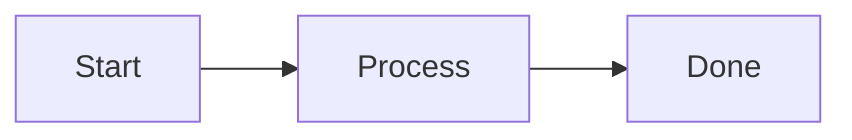
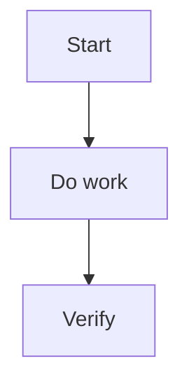

---
aliases:
  - "Documentation Style"
tags:
  - diataxis/reference
  - audience/team
  - sot/true
  - topic/documentation
status: stable
owner: docs-team
audience: team
scope: "Writing style, tone, and visual elements (MkDocs Material)"
version: v0.1.0
last_updated: 2026-01-30
updated_by: docs-team
---

# Documentation Style

This page defines writing style, tone, and visual conventions (limited to what MkDocs Material renders reliably).

---

## Language and Tone

| Item | Rule |
|------|------|
| Primary language | Traditional Chinese (zh-TW) |
| English version | Maintain synchronized `.en.md` |
| Terms | Keep technical terms in English or bilingual |
| Sentences/paragraphs | Short sentences; one idea per paragraph |
| Tone | Varies by Diataxis type |

!!! tip "Principles"
    - Headings should match intent
    - Prefer lists and tables over long paragraphs
    - Use admonitions for important notes (don’t repeat in body text)

---

## Visual Elements (recommended order: tables → admonitions → tabs → mermaid)

### Admonitions

Use `!!!` (or collapsible `???`):

```markdown
!!! tip "Optional title"
    Content must be indented by 4 spaces.

??? warning "Collapsible"
    Same 4-space indentation rule applies.
```

!!! warning "Syntax note"
    Do not use GitHub-style `> [!NOTE]` blocks.

---

### Tabs

Use `===` for variants (language / OS / context):

```markdown
=== "Python"

    ```python
    print("Hello")
    ```

=== "Julia"

    ```julia
    println("Hello")
    ```
```

---

### Mermaid

- Use for: flows, architecture, sequences
- Keep it small: nodes < 10
- Prefer: `TD` or `LR`

````markdown

````

---

### Code Blocks

Always specify the language:

```python
def hello() -> None:
    print("Hello")
```

---

## Suggested How-to Template

````markdown
# Title

1–2 sentences: what problem this solves

---

## Flow



---

## Steps

### 1. Step one
### 2. Step two

---

## Required checks

| Check | Command | Required |
|---|---|---|
| Docs build | `uv run mkdocs build` | ✅ |

---

## References

- [Relevant rules]
````

---

## Agent Rule { #agent-rule }

```markdown
## Documentation Style
- **Language**: zh-TW primary; keep `.en.md` synchronized
- **Tone**: Tutorial guiding / How-to imperative / Reference neutral / Explanation reasoning
- **Terms**: keep technical terms in English or bilingual
- **Admonitions**: use MkDocs Material `!!!` / `???` (4-space indent)
- **Tabs**: use `===` for variants (OS/language/context)
- **Mermaid**: prefer `TD`/`LR`, keep nodes < 10
- **Code blocks**: always specify language
```
