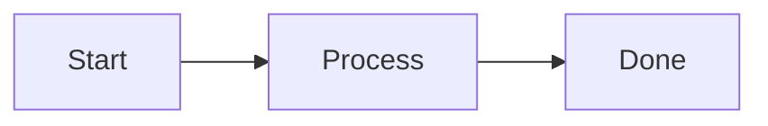
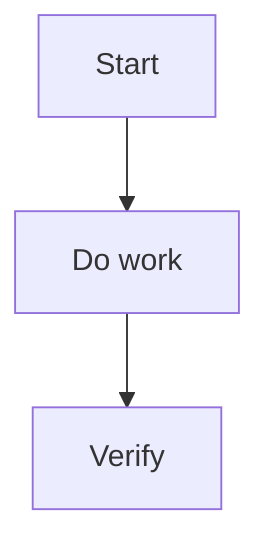

---
aliases:
  - "Documentation Style"
  - "文件風格"
tags:
  - diataxis/reference
  - audience/team
  - sot/true
  - topic/documentation
status: stable
owner: docs-team
audience: team
scope: "撰寫風格、語氣調性與視覺元素使用規範（MkDocs Material）"
version: v0.1.0
last_updated: 2026-01-30
updated_by: docs-team
---

# Documentation Style

本文件定義文件撰寫的風格、語氣與視覺呈現規範（以 MkDocs Material 可渲染的語法為準）。

---

## 語言與語氣

| 項目 | 規範 |
|------|------|
| 主要語言 | 繁體中文（zh-TW） |
| 英文版 | 同步維護 `.en.md` |
| 專有名詞 | 優先保留英文或中英並列（例如：`SQUID`、導納 (Admittance)） |
| 句子/段落 | 短句、短段落；每段一個重點 |
| 語氣 | 依 Diataxis 調整：Tutorial 引導、How-to 指令式、Reference 中立、Explanation 解釋式 |

!!! tip "寫作原則"
    - 標題直接反映內容目的
    - 優先用條列與表格；避免長段落堆疊
    - 重要提醒用 Admonitions，不在正文重複

---

## 視覺元素（建議順序：表格 → Admonitions → Tabs → Mermaid）

### Admonitions

使用 `!!!`（或可摺疊 `???`）：

```markdown
!!! tip "標題（可選）"
    內容必須縮排 4 空格。

??? warning "可摺疊"
    內容同樣需要 4 空格縮排。
```

!!! warning "語法注意"
    不要使用 GitHub 風格 `> [!NOTE]`，MkDocs Material 不會正確渲染。

---

### Tabs

使用 `===` 區分情境（例如：不同語言 / 不同 OS）：

```markdown
=== "Python"

    ```python
    print("Hello")
    ```

=== "Julia"

    ```julia
    println("Hello")
    ```
```

---

### Mermaid

- 用途：流程圖、架構圖、序列圖
- 建議：節點 < 10，保持可讀性
- 方向：優先 `TD` 或 `LR`

````markdown

````

---

### 程式碼區塊

程式碼區塊必須標註語言：

```python
def hello() -> None:
    print("Hello")
```

---

## How-to 文件建議模板

````markdown
# 標題

1–2 句說明（說清楚「要解決什麼問題」）

---

## 開發流程



---

## 步驟

### 1. 步驟一
### 2. 步驟二

---

## 必要檢查

| 檢查項目 | 指令 | 必要性 |
|---|---|---|
| Docs build | `uv run mkdocs build` | ✅ |

---

## 參考

- [相關規範連結]
````

---

## Agent Rule { #agent-rule }

```markdown
## Documentation Style
- **Language**: zh-TW primary; keep `.en.md` synchronized
- **Tone**: Tutorial guiding / How-to imperative / Reference neutral / Explanation reasoning
- **Terms**: keep technical terms in English or bilingual
- **Admonitions**: use MkDocs Material `!!!` / `???` (4-space indent)
- **Tabs**: use `===` for variants (OS/language/context)
- **Mermaid**: prefer `TD`/`LR`, keep nodes < 10
- **Code blocks**: always specify language
```
