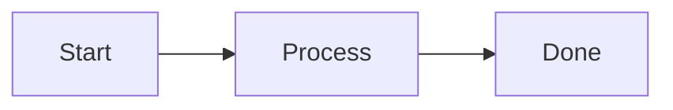
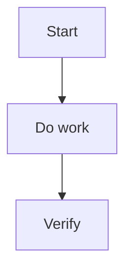

---
aliases:
  - "Documentation Style"
  - "文件風格"
  - "Micro Style"
  - "Writing & Visual Elements"
tags:
  - diataxis/reference
  - audience/team
  - sot/true
  - topic/documentation
status: stable
owner: docs-team
audience: team
scope: "Micro Style / Writing & Visual Elements：語氣、段落寫法與視覺元素使用（Zensical）"
version: v0.6.0
last_updated: 2026-03-13
updated_by: team
---

# Micro Style / Writing & Visual Elements

本文件定義 `Documentation Style` 的微觀層，負責語氣、段落寫法與視覺元素的正式規範（以 Zensical 可渲染的語法為準）。

!!! info "對應的 Macro Style"
    如果你要處理的是整頁的資訊分層、overview/index 的頁面地圖、或如何避免正文重複 sidebar，請改看 [Macro Style / Information Layout](./information-layout.md)。
    本頁只處理寫法、語氣與視覺元件的使用方式。

---

## 語言與語氣

| 項目 | 規範 |
|------|------|
| 主要語言 | 繁體中文（zh-TW） |
| 專有名詞 | 優先保留英文或中英並列（例如：`SQUID`、導納 (Admittance)） |
| 句子/段落 | 短句、短段落；每段一個重點 |
| 語氣 | 依 Diataxis 調整：Tutorial 引導、How-to 指令式、Reference 中立、Explanation 解釋式 |

!!! tip "寫作原則"
    - 標題直接反映內容目的
    - 優先用條列與表格；避免長段落堆疊
    - 重要提醒用 Admonitions，不在正文重複

---

## 視覺元素（建議順序：表格 → Admonitions → Tabs → Mermaid）

### Admonitions

使用 `!!!`（或可摺疊 `???`）：

```markdown
!!! tip "標題（可選）"
    內容必須縮排 4 空格。

??? warning "可摺疊"
    內容同樣需要 4 空格縮排。
```

!!! warning "語法注意"
    不要使用 GitHub 風格 `> [!NOTE]`，Zensical 不會正確渲染。

!!! info "使用原則"
    Admonitions 是語意強調工具，不是一般段落的替代品。
    只有在內容真的需要被讀者快速辨識成「建議 / 風險 / 範例 / 驗證狀態 / 次要細節」時才使用。

#### 什麼情況該用哪一種

| 類型 | 適用情境 | 想傳達的語氣 |
|------|----------|--------------|
| `!!! tip` | 推薦做法、較佳路徑、最佳實務 | 你最好這樣做 |
| `!!! info` | 中性背景、補充理解、上下文說明 | 這有助於理解 |
| `!!! warning` | 風險、限制、容易誤解的邊界 | 這裡很容易出錯 |
| `!!! example` | 指令、程式碼、輸入輸出示例 | 這是實際長相 |
| `!!! success` / `!!! check` | 正確狀態、驗收條件、預期結果 | 這是正確完成的樣子 |
| `???` | 次要補充、進階細節、邊界案例 | 這有用，但不是第一輪必讀 |

#### 選用判斷

- `tip`
  用在明確推薦讀者採取某種寫法或結構，能避免後續文件變亂時。
- `info`
  用在補充背景，但不構成風險或硬限制時。
- `warning`
  用在若忽略就可能寫錯、誤解契約、或讓讀者採取錯誤實作時。
- `example`
  用在具體命令、程式碼、payload、畫面結構示例時。
- `success` / `check`
  用在驗證結果、正確狀態、完成條件時。
- `???`
  用在值得保留、但不應打斷主閱讀流的進階說明時。

!!! tip "簡單判斷法"
    如果你拿不定主意，先問自己：
    1. 這段如果忽略，會不會導致錯誤？若會，優先用 `warning`。
    2. 這段是不是推薦讀者採取較好的方法？若是，用 `tip`。
    3. 這段只是幫助理解背景？若是，用 `info`。
    4. 這段是在示範具體做法？若是，用 `example`。
    5. 這段是在描述正確完成狀態？若是，用 `success` / `check`。
    6. 這段只是次要補充？若是，用 `???`。

!!! warning "避免過度使用"
    如果一整頁幾乎每個小節都包進 admonition，閱讀節奏反而會更差。
    一般說明、正常段落、普通條列，應維持在正文中完成。

---

### Tabs

使用 `===` 區分情境（例如：不同語言 / 不同 OS）：

```markdown
=== "Python"

    ```python
    print("Hello")
    ```

=== "Julia"

    ```julia
    println("Hello")
    ```
```

---

### Mermaid

- 用途：流程圖、架構圖、序列圖
- 建議：節點 < 10，保持可讀性
- 方向：優先 `TD` 或 `LR`

````markdown

````

---

### 程式碼區塊

程式碼區塊必須標註語言：

```python
def hello() -> None:
    print("Hello")
```

---

## How-to 文件建議模板

````markdown
# 標題

1–2 句說明（說清楚「要解決什麼問題」）

---

## 開發流程



---

## 步驟

### 1. 步驟一
### 2. 步驟二

---

## 必要檢查

| 檢查項目 | 指令 | 必要性 |
|---|---|---|
| Docs build | `./scripts/build_docs_sites.sh` | ✅ |

---

## 參考

- [相關規範連結]
````

---

## Agent Rule { #agent-rule }

```markdown
## Micro Style / Writing & Visual Elements
- **Language**: zh-TW primary
- **Tone**: Tutorial guiding / How-to imperative / Reference neutral / Explanation reasoning
- **Terms**: keep technical terms in English or bilingual
- **Pairing**: macro-level page layout belongs to `information-layout.md`
- **Admonitions**: use Zensical `!!!` / `???` (4-space indent); choose `tip/info/warning/example/success` by semantic intent, not decorative emphasis
- **Tabs**: use `===` for variants (OS/language/context)
- **Mermaid**: prefer `TD`/`LR`, keep nodes < 10
- **Code blocks**: always specify language
```
