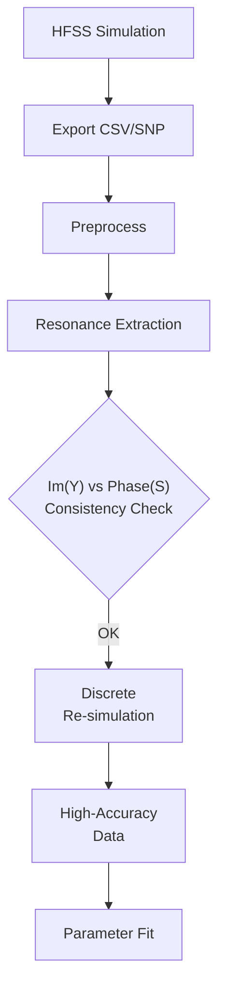

---
aliases:
- Simulation Workflow
- 模擬分析工作流
tags:
- audience/team
status: draft
owner: docs-team
audience: team
scope: 完整 HFSS 模擬到參數提取的端到端流程
version: v1.1.0
last_updated: 2026-01-31
updated_by: docs-team
---

# Simulation Workflow (HFSS to Parameter Extraction)

本教程涵蓋從 ANSYS HFSS 模擬到 SQUID 參數提取的**完整流程**。

!!! tip
    如果你已經有 CSV 數據，可以直接跳到 [Resonance Fitting](resonance-fitting.md)。

## Overview

<div align="center">



</div>


---

## Step 1: HFSS Simulation Setup

### 1.1 Parametric L_jun Sweep

在 HFSS 中設定一個 **Design Variable** `L_jun`，代表 Junction Inductance (單位: nH)。

建議掃描範圍：

- **Coarse Sweep**: `L_jun = 0.1 nH ~ 10 nH`，步長 `0.5 nH`
- **Fine Sweep**: 根據初步結果縮小範圍

### 1.2 Frequency Range

| Mode Type | Suggested Range |
|-----------|-----------------|
| JPA Mode (低頻) | 1 ~ 12 GHz |
| SRF Mode (高頻) | 8 ~ 20 GHz |

!!! note
    確保頻率範圍涵蓋預期的共振頻率，否則後續擬合會失敗。

### 1.3 What to Export

從 HFSS 匯出以下檔案：

| Parameter | HFSS Export Name | Purpose |
|-----------|-----------------|---------|
| **Im(Y11)** | `im(Y(1,1))` | 主要共振提取方法 |
| **Phase(S11)** | `ang_deg(S(1,1))` | 交叉驗證共振頻率 |

---

## Step 2: Resonance Extraction (Im(Y) Method)

這是主要的共振頻率提取方法。詳細操作見 [End-to-End Fitting Tutorial](end-to-end-fitting.md)。

```bash
# 匯入數據 (CLI/UI)
uv run sc preprocess admittance data/raw/admittance/MyChip_Im_Y11.csv

# 執行擬合與視覺化
uv run sc analysis fit lc-squid MyChip_Im_Y11
```

---

## Step 3: Resonance Extraction (Phase(S) Method)

使用 S11 的相位數據來交叉驗證共振頻率。

### 3.1 Preprocess

```bash
uv run sc preprocess phase data/raw/phase/MyChip_Phase_S11.csv
```

### 3.2 Extraction (Manual)

!!! warning
    目前 Phase 方法尚未整合至 CLI 工具，需手動分析。

**原理**：共振點會造成相位的 $180°$ 突變 (Group Delay 峰值)。

**手動分析步驟**：
1. 使用 `src/extraction/phase.py` 中的函式
2. 或在 HFSS 中直接觀察 Phase vs Frequency 曲線的拐點

---

## Step 4: Consistency Check (Im(Y) vs Phase(S))

**目的**：確保兩種方法提取的共振頻率一致。

### 手動比較

1. 記錄 Im(Y) 方法的 $f_0$ (每個 $L_{jun}$ 值)
2. 記錄 Phase(S) 方法的 $f_0$
3. 計算差異：$\Delta f = |f_{Y} - f_{S}|$

**預期結果**：
- $\Delta f < 0.01$ GHz：一致性良好
- $\Delta f > 0.05$ GHz：需檢查模擬設定或 Port 阻抗

!!! note
    差異來源：S-parameter 會受到 Port Impedance ($Z_0$) 影響，而 Y-parameter 是純元件特性。

---

## Step 5: Discrete Re-simulation

當初步分析確認共振頻率範圍後，進行高精度再模擬。

### 5.1 HFSS Settings (手動操作)

1. **Sweep Type**: 改為 **Discrete**
2. **Frequency Points**: 只掃描共振附近 (例如 $f_0 \pm 0.5$ GHz，每 10 MHz 一點)
3. **Solution Type > Advanced**:
   - **Order of Basis Functions**: Second Order
   - **Maximum Delta S**: 0.001 (或更小)

### 5.2 Re-export

完成後，重新匯出高精度數據，覆蓋原始 CSV/SNP。

---

## Step 6: Re{Y_in} from S (HFSS 內部操作)

!!! important
    此步驟在 HFSS 內完成，非本專案工具。

在 HFSS 的 **Results > Create Report** 中：

1. **Category**: Terminal Solution Data
2. **Quantity**: `re(Yin(Port1))`
3. **X-axis**: Frequency

**用途**：觀察 $Re\{Y_{in}\}$ 的峰值位置，這對應於共振點的功率吸收。

---

## Next Steps

- [Resonance Fitting Tutorial](end-to-end-fitting.md) - 完整 LC 模型擬合
- [SQUID Fitting How-to](../how-to/fit-model/squid.md) - CLI 參數詳解
